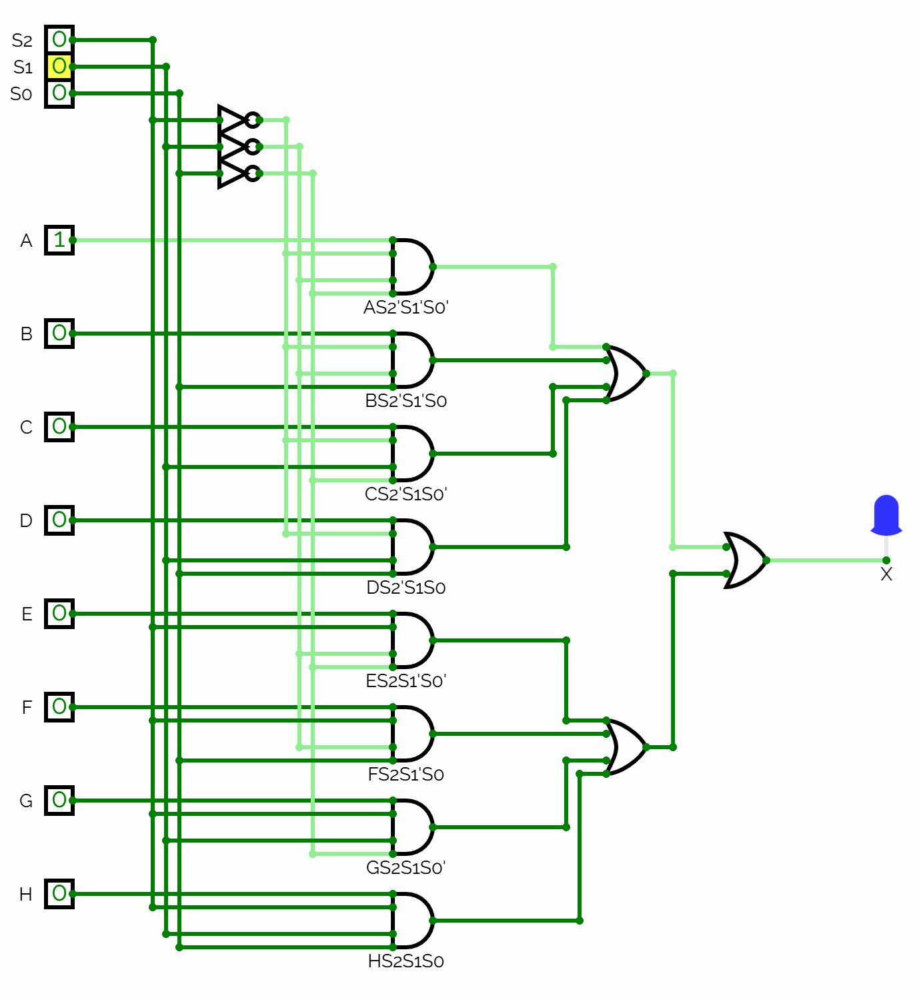

# Appendix A - Larger Networks and Multiplexers

## A.1 Karnaugh maps: from truth table to minimized gate network
Reading a sum-of-products equation straight off a truth table, the way
[L01 A.2](../../L01/appendix/a_combinational_logic.md#a2-boolean-algebra-notation) did, always
works but rarely gives the smallest network: every `1` row becomes its own AND-term, even when
several rows share most of their inputs and could be combined.

A **Karnaugh map** (K-map) makes those shared patterns visible by hand, for functions of 2 to 4
variables, with no formal Boolean-algebra manipulation. One worked example follows; further practice
is in [Appendix B](./b_exercises.md), and classical minimization theory (don't-cares,
Quine-McCluskey) is out of scope.

The idea is to lay the truth table out as a grid rather than a list, ordering the header labels so
every cell differs from each horizontal and vertical neighbour in exactly one input value, including
around the left/right and top/bottom edges. That ordering is **Gray code**: for two bits,
`00, 01, 11, 10`, where only one bit changes at each step, including from the last entry back to the
first.

Then:
1. Write a `1` in every cell where the output is `1`, and leave the rest blank.
2. Draw rectangular groups around the `1`s:
   * Every group must be a rectangle whose width and height are each a power of 2 (1, 2 or 4),
     so its size is a power of 2 as well.
     * a group of 4 is therefore either a 1x4 line or a 2x2 block, and both are allowed.
     * cells that touch only at a corner are not a rectangle, so they cannot be grouped.
   * Groups may overlap, and may wrap around an edge of the grid.
3. Make every group as large as possible, and cover every `1` at least once. A group of 1 keeps all
   its inputs in the term, a group of 2 drops one, a group of 4 drops two, and so on.
   * Then use as few groups as will do it: drop any group whose cells are every one of them already
     covered by another. Nothing above forbids a redundant group, and a redundant group is a
     redundant AND-term in the answer, correct but not minimal.
4. For each group, keep only the input(s) that hold the same value in every cell of that group,
   dropping the rest, and write that as one AND-term:
   * write a kept input directly if that constant value is `1`, and primed if it is `0`.
   * so a group covering only cells where `B = 0` contributes the term `B'`.
5. `X` is the OR of all the group terms.

### Worked example
Three inputs `A`, `B`, `C`, one output `X`:

| A | B | C | X |
|---|---|---|---|
| 0 | 0 | 0 | 0 |
| 0 | 0 | 1 | 1 |
| 0 | 1 | 0 | 0 |
| 0 | 1 | 1 | 1 |
| 1 | 0 | 0 | 0 |
| 1 | 0 | 1 | 1 |
| 1 | 1 | 0 | 1 |
| 1 | 1 | 1 | 1 |

Lay it out with `AB` in Gray code down the rows and `C` across the columns, filling in a `1`
wherever `X = 1`:


The entire `C = 1` column is four `1`s, a group of 4. Every cell shares `C = 1` and nothing else is
constant (`A` and `B` both vary), so it reduces to the single-variable term `C`:


One `1` is still uncovered, on the `AB = 11` row. Group it with its neighbour to the right, which
the `C` group already covers. Every cell in the pair shares `A = 1` and `B = 1`, and `C` varies, so
it reduces to `AB`:


Every `1` is now covered; the `AB = 11, C = 1` cell is in both groups, and overlap is fine. Summing
gives:

```text
X = AB + C
```

Reading the truth table directly, L01-style, would have given five AND-terms, one per `1` row. The
K-map found an equivalent two-term equation, which is the entire value of doing this by hand.

### Realizing the network
`X = AB + C` is two gates: an `AND` computing `AB`, feeding an `OR` whose other input is `C`.


You build this network by hand in CircuitVerse during the lecture, exactly as you built `or_gate`'s
in L01, and translate it into VHDL in A.2.

---

## A.2 Translating the Karnaugh-map network into VHDL
`X = AB + C` translates straight into VHDL. Three inputs, one output:

```vhdl
library ieee;
use ieee.std_logic_1164.all;

entity gate_network is
    port(a, b, c: in std_logic;
         x      : out std_logic);
end entity;
```

The architecture uses an internal signal `ab` to hold the `AND` gate's output, mirroring the
two-gate network one-for-one:

```vhdl
architecture behaviour of gate_network is
signal ab: std_logic;
begin
    -- AND gate: AB.
    ab <= a and b;

    -- OR gate: AB + C.
    x <= ab or c;
end architecture;
```

Without the intermediate signal this collapses to `x <= (a and b) or c;`. Both are equally valid and
synthesize to the same hardware; use whichever is more readable for the network at hand.

The buildable version at [`../gate_network/gate_network.vhd`](../gate_network/gate_network.vhd) uses
the collapsed form, since at two gates there is nothing to gain from naming the intermediate. Open
it alongside the version above and satisfy yourself they describe the same circuit; that is the
claim this section is making, and it costs nothing to check.

To run it on hardware, assign the ports to switches and an LED with the DE0-CV's pin planner
([info/quartus_workflow.md](../../../info/quartus_workflow.md)). Nothing here depends on specific
pin numbers.

---

## A.3 `std_logic_vector`: more than one wire
Everything so far has been `std_logic`, one wire carrying one bit. Bundling several wires under one
name is what `std_logic_vector` is for.

```vhdl
signal count: std_logic_vector(3 downto 0);
```

That declares four wires: `count(3)` down to `count(0)`. The range is `3 downto 0` rather than
`0 to 3` so the leftmost bit is the most significant, the way you would write the number on paper.
This course uses `downto` everywhere, and so does almost all the VHDL you will meet.

A vector is a port type like any other:

```vhdl
entity display is
    port(number: in  std_logic_vector(3 downto 0);
         hex   : out std_logic_vector(6 downto 0));
end entity;
```

### Values
A single bit takes single quotes, a vector double quotes:

```vhdl
x     <= '1';                -- std_logic: one bit
count <= "1010";             -- std_logic_vector(3 downto 0): four bits
count <= (others => '0');    -- every bit '0', whatever the width
```

The last is an *aggregate*: `(others => '0')` means "all the remaining bits are `'0'`", and since
none were named individually, that is all of them. It keeps working when the width changes, and it
appears throughout the rest of the course.

### Indexing and slicing
One bit out of a vector is a `std_logic`; a contiguous run is a *slice*, itself a vector:

```vhdl
carry     <= count(3);
high_half <= input(7 downto 4);
```

Slicing is how one wide port feeds several narrower ones, which is what A.6's two-digit display does
with its eight switch inputs.

One detail is not what a software engineer expects. `input(7 downto 4)` has the index range
`7 downto 4`, not `3 downto 0`. Connected to a port declared `std_logic_vector(3 downto 0)`, the two
are matched **by position, left to right**, not by index number: `input(7)` drives bit 3, `input(6)`
drives bit 2, and so on. The lengths have to match. The numbering does not.

### A vector is a bundle of bits, not a number
`count <= "1010"` does not make `count` equal ten. `std_logic_vector` says nothing about what the
bits *mean*, so it offers only the operations that make sense for a bundle of wires: the logical
operators applied bit by bit (`a and b`, `not a`, `a xor b`), comparison (`count = "1010"`), and
concatenation (`"10" & "11"` is `"1011"`).

Arithmetic is not on that list. `count + 1` will not compile, because nothing has said whether those
four wires are an unsigned number, a signed one, or four unrelated signals.

This course does not work around that with a numeric vector type. Anything counted is a plain
integer with a range:

```vhdl
signal count: natural range 0 to 9;
```

which you can add to and compare directly, and which synthesis turns into exactly the flip-flops the
range needs. Vectors stay what they are: bundles of wires, for things that really are bundles of
wires, like eight switches or seven display segments.

The two worlds meet only at a boundary, and the conversions appear where they are needed:

```vhdl
count_v <= std_logic_vector(to_unsigned(count, 4));   -- integer to vector
count   <= to_integer(unsigned(count_v));             -- vector to integer
```

Both come from `ieee.numeric_std`, which is why some files add a third `use` clause.

---

## A.4 Multiplexers
A **multiplexer** ("mux") routes exactly one of several data inputs to a single output, chosen by a
separate set of **selector** inputs. An `N`-to-1 mux has `N` data inputs and `ceil(log2(N))`
selector bits.

The simplest case, a 2-to-1 mux with inputs `A`, `B`, selector `S` and output `X`:

| S | X |
|---|---|
| 0 | B |
| 1 | A |

As a Boolean equation, `X = S'B + SA`: for every input combination exactly one AND-term is active,
and that term's data input passes through.

Larger muxes are the same pattern with more selector bits. An 8-to-1 mux with data inputs `A`-`H`
and selector `S[2:0]`:

| S[2:0] | X |
|-------:|---|
| 000 | A |
| 001 | B |
| 010 | C |
| 011 | D |
| 100 | E |
| 101 | F |
| 110 | G |
| 111 | H |

Read into sum-of-products one term per row, the `000` row contributes `A*S2'S1'S0'` and the rest
follow the same shape, each gating its data input with the selector combination that selects it:

```text
X = AS2'S1'S0' + BS2'S1'S0 + ... + HS2S1S0
```

Worth writing out once by hand, not worth memorizing. The pattern is the point, and it is the same
at any size.

As gates: one 4-input `AND` per data input (the data bit plus all three selector bits), inverting
selector bits as needed, with all eight `AND` outputs summed by a tree of `OR` gates.



This is a real building block. The ATmega328P (the chip on an Arduino Uno/Nano) uses one internally
so its analog-capable pins, plus an internal bandgap reference and a temperature sensor, can share a
single analog-to-digital converter, selected by the four `MUX` bits of its `ADMUX` register.

---

## A.5 Multiplexers in VHDL: `process` and `case`
Every statement so far has been **concurrent**: a standing description of a wire, all active at
once. A multiplexer is the first circuit that is awkward to write that way, and needs two new
constructs:
* a **`process`**, a block whose contents run sequentially, top to bottom, like ordinary code. It
  re-runs whenever any signal in its **sensitivity list** changes, and from the architecture's point
  of view it is still just one more concurrent statement. Every process in this course has this
  shape; L03 reuses it for clocked logic, with the clock in the sensitivity list instead of the
  inputs being decoded.
* a **`case` statement**, VHDL's `switch`. Like `if` and `for` it is a *sequential* statement, legal
  only inside a process, and every value the selector can take must be covered, which `when others`
  guarantees.

"Pick one of several inputs based on a selector" *is* a `case` statement, almost word for word. The
2-to-1 mux from A.4:

```vhdl
MUX_PROCESS: process(a, b, sel) is
begin
    case (sel) is
        when '0'    => x <= b;
        when '1'    => x <= a;
        when others => x <= '0';
    end case;
end process;
```

Two points from that:
* Single-bit values take single quotes, `'0'`/`'1'`, as opposed to the double quotes used for
  vectors like `"000"`.
* `when others` is required rather than defensive. VHDL insists a `case` cover every value of its
  selector's type, and `std_logic` has nine
  ([L01 A.4](../../L01/appendix/a_combinational_logic.md#a4-enough-vhdl-to-read-and-write-a-gate-circuit)),
  so `'0'` and `'1'` alone never make one exhaustive. This is a language rule, not a claim about the
  wire: a synthesized net carries a `0` or a `1` and nothing else, and the other seven values are
  the simulator's, where a signal sitting at `'U'` or `'X'` is a bug rather than a level.

### Worked example: the 8-to-1 mux
Same shape with a 3-bit selector and eight branches, one per row of A.4's truth table. The data
inputs `A`-`H` become the vector `inputs(7 downto 0)`, with `A` as `inputs(7)` down to `H` as
`inputs(0)`, so selector `"000"` routes `inputs(7)` and `"111"` routes `inputs(0)`.

The buildable module is at [`../mux_8to1/mux_8to1.vhd`](../mux_8to1/mux_8to1.vhd).

Compare it against A.4's eight-term equation for the same circuit. The equation describes the gates;
the `case` describes the *intent* and lets the synthesis tool produce the gates. Both are correct and
both synthesize to the same hardware. That gap, between describing structure and describing
behaviour, is most of what a hardware description language buys you.

---

## A.6 Building a design from submodules
Everything so far has been one entity with one architecture. That stops being enough the moment a
design needs the same block twice.

The DE0-CV has six 7-segment displays, and you want to drive two, each showing one hexadecimal
digit. The logic turning a 4-bit number into seven segment signals is the same for both. You could
write it twice inside one architecture and nothing would stop you, but the second copy is a
liability: every fix has to be made in both, and the day they drift apart is the day you lose an
evening working out which one is wrong.

Write the block once, as its own entity, and *instantiate* it twice.

### The submodule
An ordinary module. Nothing about it says "I am a submodule":

```vhdl
entity display is
    port(number: in  std_logic_vector(3 downto 0);
         hex   : out std_logic_vector(6 downto 0));
end entity;
```

Whether it ends up as a whole design or one piece of a larger one is decided by whoever instantiates
it, not by the module.

### Instantiating it
With `entity work.<name>`, inside another architecture:

```vhdl
entity hex_display is
    port(input     : in  std_logic_vector(7 downto 0);
         hex1, hex0: out std_logic_vector(6 downto 0));
end entity;

architecture structure of hex_display is
begin
    display1: entity work.display
        port map(input(7 downto 4), hex1);

    display0: entity work.display
        port map(input(3 downto 0), hex0);
end architecture;
```

* `display1` and `display0` are **instance labels**, naming the two copies. They must be unique
  within the architecture, and they are not the module's name: both instances are `display`.
* `entity work.display` selects the module. `work` is the library your analyzed files land in by
  default, in GHDL and Quartus alike.
* `port map(...)` connects the instance's ports to signals in the enclosing architecture, **in the
  order that entity declares them**. `display` declares `number` then `hex`, so the first item
  drives `number` and the second is driven by `hex`.
* `input(7 downto 4)` is a **slice**, which the instance sees as a `std_logic_vector(3 downto 0)`.

Note what `hex_display`'s architecture does *not* contain: any logic. It is wiring and nothing else.
Every gate in the finished design comes from the two `display` instances.

### Positional and named association
The `port map` above is **positional**, matching ports by order. VHDL also allows **named**
association, which you will meet in other people's code:

```vhdl
display1: entity work.display
    port map(number => input(7 downto 4), hex => hex1);
```

The two are equivalent. This course uses positional everywhere, which means an entity's port
declaration order is something you have to get right. That is not a formality: it is exactly what
the testbenches you are given rely on, which is why every exercise's self-check line spells out its
ports *in order*.

### What this costs in hardware
Nothing surprising. Instantiating a module twice puts two copies of its gates on the FPGA, exactly
as writing the logic twice would. The saving is in the source, not the silicon: one description, one
place to fix, and a design you can read.

---

## A.7 Checking your work
Every VHDL module you write for an exercise comes with a **self-checking testbench**: a small VHDL
file that drives your inputs, checks your outputs, and tells you which case failed. L01's exercise 2
already shipped one, and L01 A.5 gave you the three commands that run it.

You do not write testbenches in this course, which is the follow-on CAN Controller Design course's
subject. Running them is enough to verify every exercise on your own laptop, with no FPGA board.

[Appendix C](./c_testbenches.md) is the full guide: what a testbench is and why its entity has no
ports, the analyze -> elaborate -> run sequence, how to read a failed assertion, and how your
module's **port order** has to match what the testbench expects.

Run one now, against this lecture's worked example:

```bash
cd lectures/L02/gate_network
ghdl -a --std=93 gate_network.vhd gate_network_tb.vhd
ghdl -e --std=93 gate_network_tb
ghdl -r --std=93 gate_network_tb --assert-level=error --stop-time=10ms
```

---
