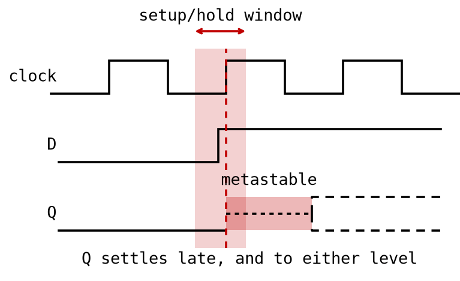
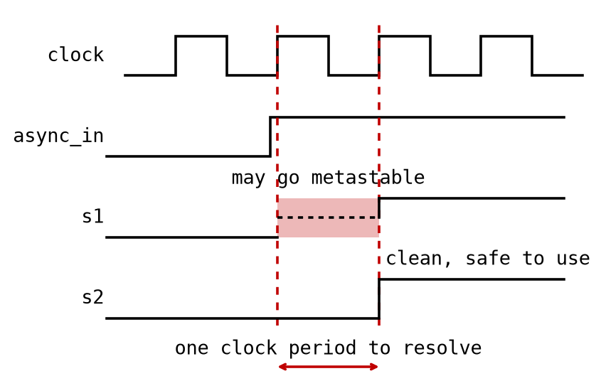

# Appendix A - Metastability and Synchronization

## A.1 The problem: a button isn't a testbench signal
In [L03](../../L03/README.md) you built edge detectors and reasoned about them against a clean
clock, where every input changed neatly between edges, exactly the way a simulator draws it. A push
button, an external reset line, or any signal from another clock domain changes whenever the outside
world decides to, completely independent of your FPGA's clock.

Every D flip-flop has two timing requirements around the active clock edge:
* a **setup time**: how long `D` must be stable *before* the edge.
* a **hold time**: how long `D` must stay stable *after* it.

If an input changes inside that window the flip-flop is not guaranteed to capture a clean `0` or
`1`, and you can never promise it will land outside, because you do not control when an external
signal changes. The rest of this lecture solves that not by avoiding the problem but by containing
it.

---

## A.2 Metastability: what actually happens inside the flip-flop
A D flip-flop is built from cross-coupled gates that snap to `0` or `1` the instant the clock
samples the input. If `D` changes too close to the edge, the internal feedback loop can be left
balanced between the two states, neither fully high nor fully low, for longer than expected. That is
**metastability**.

Picture a ball balanced exactly on top of a hill. Given enough time it rolls down one side, but
exactly when it commits, and to which side, is not predictable from the moment it was placed there,
and while it is still balanced its position is not a valid digital value at all.

A metastable output behaves the same way:
* it almost always resolves to a valid `0` or `1` on its own, given enough time.
* "enough time" is not free, and is not the same on every clock cycle.
* if the unresolved voltage reaches downstream logic before it settles, different gates can
  legitimately read it differently: one sees `0`, another `1`, at the same instant.

That disagreement is where real systems misbehave: a counter that increments in one part of the
circuit but not another, or a state machine in an impossible state. Everything in this lecture exists
to make sure metastability resolves *before* a signal touches the rest of your design.

In time, the whole problem looks like this:



Read it left to right. The shaded band is the window from A.1, `t_su` before the edge and `t_h`
after it. `D` changes inside it, which is exactly what an input you do not control is free to do.
`Q` is then neither `0` nor `1` for a while, and when it does settle, *when* it settles and *which
level* it settles to are both outside your control. Both dashed continuations are legitimate
outcomes of the same input.

Note what the diagram does not show: a wrong answer. Sampling a signal mid-transition is allowed to
give you either level, and that on its own is harmless, because the input genuinely was changing at
that instant. The problem is the delay before you get an answer at all, and that is what the next
section buys time for.

---

## A.3 The double-flop synchronizer
The standard fix is the **double-flop synchronizer**:
* Place two D flip-flops in series on every asynchronous input: every input that changes with no
  fixed relationship to your clock. A push button, a reset line, a signal arriving from another
  clock domain.
* An input that is already clocked by *this* clock is not asynchronous, and must **not** be
  synchronized. Doing so only delays it, and shifts its timing relative to everything around it.
  `seq_detect_mealy` in L08 is exactly that case: its `din` is synchronous serial data, so it goes
  straight into the machine while `reset_n` still gets a synchronizer.
* Only ever use the output of the *second* flip-flop elsewhere in the design.

```text
async_in
   │
   ▼
 [FF1] ──────► [FF2] ──────► synchronized, safe to use
   (may go        (extremely likely
   metastable)     to be stable)
```

The same two flip-flops, in time:



`FF1` is the one exposed to the asynchronous input, so it is the one that might go metastable. Its
output only has to reach `FF2`, and it has an entire clock period to get there. The probability that
a metastable node is still unresolved after a full period is small, and shrinks the longer it is
given, so by the time `FF2` samples on the next edge, `FF1` has almost always settled. `FF2`'s output
is what you build the rest of your synchronous logic on.

This is probabilistic, not absolute, and A.4 says what that means. At the speeds used in this
course, tens of MHz, two stages are the standard, industry-accepted answer.

One rule ties it together: **every asynchronous input gets its own double-flop chain before it is
used anywhere else.** External reset buttons, push buttons, and later any **single-bit** signal
crossing from another clock domain.

That last word is load-bearing, and it is the one limit worth learning before you over-apply the
rule. A double-flop chain synchronizes **one bit**. Put a multi-bit bus through a chain per bit and
each bit is individually safe but they are not safe *together*: each independently resolves to the
old or new value on the same edge, so the receiver can sample a combination that was never on the
bus. A counter stepping from `0111` to `1000` has every bit changing at once, and a per-bit
synchronizer can hand you `1111` or `0000`, values the counter never held.

Buses crossing clock domains need a handshake, a FIFO, or Gray coding, which arranges that only one
bit ever changes at a time. This course never crosses clock domains with a bus, so you will not need
them here; the follow-on CAN Controller Design course is where they belong. Knowing that the two-flop
answer stops at one bit is enough for now.

---

## A.4 Timing intuition: why "almost certainly" is good enough
A synchronizer does not buy "no metastability". It buys metastability that gets a full clock period
to resolve before it can affect anything else, and that is a statistical argument rather than a
proof. The correct posture is "reasonably certain, backed by an extremely low, well-characterized
failure rate", not "provably safe under all conditions", which is why extra stages exist for extreme
cases instead of two being declared sufficient by law of physics.

The relationship has a standard shape, worth seeing once even though you will not compute with it
here:

```text
MTBF = e^(t_r / tau) / (T_w * f_clock * f_data)
```

Read it for what it says rather than for numbers. `t_r` is the resolution time a stage gets, roughly
one clock period; `tau` and `T_w` are both properties of the flip-flop, `tau` being how fast a
metastable value decays and `T_w` the width of the window around the clock edge in which the input
can provoke one at all. Adding a stage buys another `t_r` in the exponent, so **the numerator grows
exponentially with every stage you add**, against one clock cycle of added latency. The denominator grows linearly
with the clock rate and, just as importantly, with `f_data`: how often the asynchronous input
actually changes. A button pressed once a second and a data line toggling at 10 MHz differ by seven
orders of magnitude in that term alone, which is why the case for a third stage is a question about
the input, not about the clock.

---

## A.5 Synchronizing a reset signal: assert async, release sync
Resets deserve a specific pattern, which `reset_sync` demonstrates. There is no `reset_sync.vhd` in
this repository to open: it is [exercise 8](./b_exercises.md), and you write it. The listing below
is the whole of its logic; the `library`/`use` clauses, the `entity`, the `architecture` frame and
the declaration of the internal `reset_s1_n` are yours to add around it.

```vhdl
process(clock, reset_n) is
begin
    if (reset_n = '0') then
        reset_s1_n <= '0';
        reset_s2_n <= '0';
    elsif (rising_edge(clock)) then
        reset_s1_n <= '1';
        reset_s2_n <= reset_s1_n;
    end if;
end process;
```

* **Assert asynchronously.** When `reset_n` drops, both stages are forced to `0` immediately, with
  no dependency on the clock. A reset that waited for a clock edge would defeat its own purpose: it
  must take effect the instant it is needed, clock or no clock.
* **Release synchronously.** When `reset_n` returns to `1` the reset condition does not vanish
  everywhere at once. It shifts out through the two stages like any other asynchronous input, so
  `reset_s2_n`, the signal the design actually uses, releases cleanly on a clock edge together with
  everything else. Without this, different flip-flops could leave reset on different cycles and
  momentarily disagree about system state, the same class of bug metastability causes.

This is why `reset_n` is synchronized by its own chain before anything else depends on it, including
the button synchronizer, whose reset input is `reset_s2_n` rather than the raw `reset_n`.

---

## A.6 Reusing the chain for edge detection - and, incidentally, debouncing
The button needs synchronizing, and from [L03](../../L03/README.md) you also need to detect *when*
it is pressed rather than its level. `button_sync`, which is [exercise 9](./b_exercises.md) and so
is also yours to write rather than a file in this repository, gets both from a single chain of
**three** flip-flops:

```text
button_n
   │
   ▼
[FF1] → [FF2] → [FF3]
        │        │
        │        └─ previous value
        └─ current value
```

Flip-flops 1 and 2 are A.3's synchronizer, making `button_s2_n` the stable current value. Flip-flop
3 stores last cycle's `button_s2_n` as `button_s3_n`, the previous value. Flip-flops 1 and 2 are
worth noticing on their own: [L05 exercise 4](../../L05/appendix/b_exercises.md) extracts that
double-flop chain into a reusable `sync` module, leaving the third flip-flop here as the edge
detector's own. Comparing stage 2 against stage 3 gives edge detection for free:

`button_edge_s2 = (not button_s2_n) and button_s3_n`

which is true for exactly one clock cycle: the one where the button reads pressed now and did not
the cycle before.

**Synchronization, on its own, only solves metastability.** It says nothing about a mechanical
button's tendency to bounce: to make and break contact several times over the first millisecond or
so, each bounce looking like a separate press. What keeps this course's exercises from being swamped
by bounce is the *combination* of the chain with a detection window that is slow relative to the
bounce:
* In this lecture's CircuitVerse exercises the clock period is a full second. Bounce settles in far
  less than that, so by the next edge `button_s2_n` reads one clean level. The chain looks like it is
  debouncing, but it is really just sampling too infrequently to see bounce.
* On the FPGA the clock is `50 MHz`, one sample every `20 ns`, while bounce lasts from under a
  millisecond to a few tens of milliseconds, many thousands of cycles. At that speed `button_sync`
  faithfully detects *every* bounce transition as its own edge, and the LED could toggle several
  times for one physical press.

So precisely: the double-flop synchronizer reliably solves metastability at the speeds used here.
Whether it also *looks* like debouncing depends entirely on the clock period being slow relative to
the switch's bounce time, which is true in CircuitVerse and not automatically true on the FPGA.

---

## A.7 What real hardware debouncing adds
This course has no dedicated debounce lecture, and the worked examples deliberately keep using A.6's
circuit, bounce and all. It is good enough for a demo LED. A production design adds one of the
following *on top*:
* **An analog RC low-pass filter**, optionally with a Schmitt-trigger buffer, on the button input
  before it reaches an FPGA pin. The RC pair smooths the fast make/break transitions into a single
  gradual edge, and the Schmitt trigger, with its two switching thresholds, turns that back into one
  clean digital transition. This solves bounce before the signal is even digital, but costs board
  components and does not help for inputs that are not mechanical switches.
* **A digital debounce counter.** Rather than acting on the next detected edge, require the input to
  hold a new level for some minimum duration, a few milliseconds' worth of clock cycles, before
  accepting it. That builds your own artificially slow detection window on-chip, the same effect the
  1-second CircuitVerse clock gives for free, without slowing the system clock. You will meet
  counters in [L06](../../L06/README.md) and timers, which this technique needs, in
  [L07](../../L07/README.md).

Both sit on top of the synchronizer, not instead of it: even a perfectly debounced signal is still
asynchronous to your clock and still needs a double-flop chain.

---

## A.8 Generics: one module, several sizes
`reset_sync` and `button_sync` are built from the same idea, but only one has a question to answer.
A reset is one bit and always will be. How many *buttons* does a design have? This lecture's
`led_toggle_sync` has one, L08's `fsm_led` has two. Writing the same three-flop chain out once per
width is exactly the duplication that splitting them into modules set out to avoid.

A **generic** answers it: a value an entity declares alongside its ports, fixed when the design is
built rather than changing while it runs.

```vhdl
entity button_sync is
    generic(COUNT: natural range 1 to 3 := 1);
    port(clock, reset_s2_n: in  std_logic;
         button_n         : in  std_logic_vector(COUNT-1 downto 0);
         button_edge_s2   : out std_logic_vector(COUNT-1 downto 0));
end entity;
```

* `COUNT` behaves like a constant inside the architecture. It cannot change while the circuit runs;
  it is decided before a single gate is placed.
* `:= 1` is its default, used by any instantiation that says nothing.
* The port widths are written *in terms of it*, and so is every internal signal that follows.

### Overriding it
An instantiation passes generics with a `generic map`, before the `port map`:

```vhdl
button_sync1: entity work.button_sync
    generic map(2)
    port map(clock, reset_s2_n, button_n, button_edge_s2);
```

Generics are matched **by position**, in declaration order, exactly as ports are in
[L02 A.6](../../L02/appendix/a_larger_networks.md#a6-building-a-design-from-submodules). Leaving the
`generic map` out applies the default; this course writes it explicitly even when it matches, because
a reader should not have to open the module to find out how wide an instance is.

### When a generic is worth having
`button_sync` has one and `reset_sync` has none, and that difference is the whole rule: **add a
generic when something genuinely varies between instances, not on principle.**

`button_sync` is instantiated at `COUNT = 1` by A.9's `led_toggle_sync` and at `COUNT = 2` by L08's
`fsm_led`: two widths, one file. `reset_sync` is one bit everywhere, so a `WIDTH` generic on it would
be a parameter nobody ever passes anything but `1` to, and one more thing for a reader to check. That
second instantiation is what makes a generic worth having; a parameter with exactly one value in the
entire course would just be indirection. `button_sync`'s own testbench instantiates it at *both*
widths in one simulation, precisely to prove that one file really does serve both.

You will meet one more generic in L07: `timer`'s `TICK_COUNT`, which is a count rather than a width,
and is what lets the same file measure a fiftieth of a second in one design and a whole second in
another.

---

## A.9 Worked example: `led_toggle_sync`
This ties A.1-A.6 together into L03's toggle circuit, made safe for a real, asynchronous button and
reset.

| Port | Direction | Description |
|---|---|---|
| `clock` | in | `50 MHz` system clock on the DE0-CV board. |
| `reset_n` | in | Active-low asynchronous reset, wired to a push button. |
| `button_n` | in | Active-low push button; toggles the LED on its falling edge. |
| `led` | out | LED, toggled on each synchronized, edge-detected button press. |

Internal signals: `led_s` holds the LED state, `reset_s2_n` is the reset after the two-flop
synchronizer (the `s2` suffix is this lecture's convention for "synchronized with two flip-flops"),
and `button_edge_s2` is the one-cycle pulse marking a synchronized falling edge on `button_n`.

Like L02's two-digit display, this design is built from more than one entity, using the
instantiation from
[L02 A.6](../../L02/appendix/a_larger_networks.md#a6-building-a-design-from-submodules) and the
generic from [A.8](#a8-generics-one-module-several-sizes). The difference is what the pieces do: the
display instantiated one module twice to do the same job on two halves of its input, while this
instantiates two *different* modules with one job each. Both are the same mechanism. Composing a
design out of modules is not a special technique for repeated logic; it is how designs are built
once they outgrow a single file.

The two chains live in two subcomponents:
* `reset_sync` is A.5's two-flop reset synchronizer. It takes the raw `reset_n` and returns
  `reset_s2_n`.
* `button_sync` is A.6's three-flop synchronizer-plus-edge-detector. It takes the already
  synchronized `reset_s2_n` and pulses `button_edge_s2` once per press.

Keeping them apart matters more than it looks. A design with no button of its own still needs its
reset synchronized, and with two modules it simply instantiates the one it wants, as L08's
`seq_detect_mealy` does. Welded into one module, that design would have to instantiate the whole
thing and disable the half it does not use.

`button_sync` takes a *vector* of buttons so one file can serve a two-button design. This design has
one, so `led_toggle_sync.vhd` declares a pair of one-element vectors to connect to it:

```vhdl
signal button_n_v, button_edge_s2_v: std_logic_vector(0 downto 0);
...
button_n_v(0)  <= button_n;
button_edge_s2 <= button_edge_s2_v(0);
```

That is plumbing, not logic: two wires renamed.

The top-level architecture contains nothing but the toggle process itself, and it only ever touches
the already-synchronized `reset_s2_n` and `button_edge_s2`, never the raw inputs:

```vhdl
LED_PROCESS: process(clock, reset_s2_n) is
begin
    if (reset_s2_n = '0') then
        led_s <= '0';
    elsif (rising_edge(clock)) then
        if (button_edge_s2 = '1') then
            led_s <= not led_s;
        end if;
    end if;
end process;
```

Full source of the top level: [`led_toggle_sync.vhd`](../led_toggle_sync/led_toggle_sync.vhd). The
two subcomponents are not in the repo, because writing them is
[exercises 8 and 9](./b_exercises.md). What this appendix gives you of each is:
`reset_sync`'s process in [A.5](#a5-synchronizing-a-reset-signal-assert-async-release-sync) above,
and `button_sync`'s chain as a diagram and an equation in
[A.6](#a6-reusing-the-chain-for-edge-detection---and-incidentally-debouncing) with its entity in
[A.8](#a8-generics-one-module-several-sizes). The surrounding entity and architecture in the first
case, and the whole architecture body in the second, are the exercises' own work. Copy your own
into `led_toggle_sync/` to build it.

**By hand, in CircuitVerse first.** Before touching VHDL, build it as a gate network: two D
flip-flops in series for the reset synchronizer; two for `button_n` plus a third storing the previous
synchronized value; an AND gate combining the inverted current value with the previous one to produce
`button_edge_s2`; and a toggle flip-flop for `led_s`, its inverted output fed back to its input,
enabled only when `button_edge_s2 = 1`. Set the clock period to `1000 ms` so you can watch each
stage by eye.


One thing in the drawing needs reading carefully: the flip-flops carry a `preset` input, and on the
three button-synchronizer stages it is tied to `1`. That is not decoration. In CircuitVerse,
`preset` is the value a flip-flop loads when its reset is asserted, so tying it to `1` is what makes
`button_s1_n`, `button_s2_n` and `button_s3_n` come out of reset holding `1` rather than `0`.

That matches `button_sync`, which resets the same three stages to `(others => '1')`, and it
matters for the same reason: the buttons are active-low, so `1` means "released". Reset the chain
to `0` instead and it comes up claiming the button is already held down. The reset flip-flops leave
`preset` alone, because there a reset to `0` really is all the circuit asks for.

Press the button in the simulation and watch it propagate. The LED does not toggle instantly: it
waits for the synchronized, edge-detected pulse to reach the toggle flip-flop, which takes a small,
fixed number of clock pulses, exactly the latency A.3 called the price of safety.

**On the FPGA:** the same design is demonstrated on the Terasic DE0-CV (device `5CEBA4F23C7N`)
during the lecture, with `clock` on the `50 MHz` oscillator, `reset_n` and `button_n` on two push
buttons, and `led` on an LED. The LED toggles on every press, and per A.6 a real press may
occasionally produce more than one toggle from contact bounce.

---
