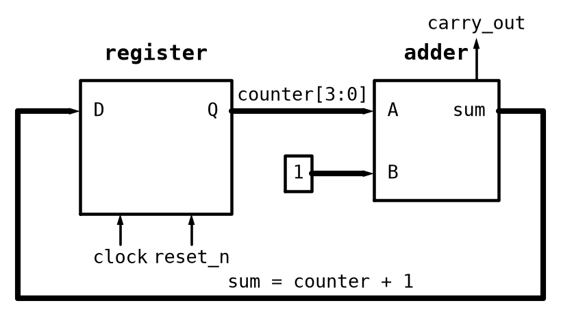

# Appendix A - Counters and Shift Registers

## A.1 From registers to counters
A register (L03) is a bank of D flip-flops storing whatever value is fed in on the next rising edge.
A **counter** is the same idea with one twist: instead of a new value from outside, you feed the
register its *own current value plus one*. Each edge it captures `current_value + 1`, so the stored
number increments once per clock cycle with no further input.

### Build it by hand first
As with every circuit in this course, build it before you write it. A 4-bit counter is three
elements, and watching it run is the point:
* A **4-bit register**: four D flip-flops sharing one clock, exactly the register from
  [L03 A.5](../../L03/appendix/a_flip_flops_and_registers.md#a5-registers-flip-flops-in-parallel).
* An **adder** and a **constant `1`**: the register's four outputs into one adder input, the
  constant into the other.
* The adder's sum wired back to the register's four `D` inputs. That feedback path is the whole
  circuit: the register holds a number, the adder computes that number plus one, the next edge
  stores it. It is L03 A.1's feedback loop again, with an adder in the path instead of a plain wire.



Then confirm, one clock edge at a time, with a period of `1000 ms`:
* Watch the outputs step `0000, 0001, 0010, 0011, ...`, one count per rising edge.
* **Let it run past `1111`.** It returns to `0000` on its own, and nothing in your circuit says to
  do that: there is no comparison, no reset logic, no "if the count is at maximum" anywhere. The
  adder produced `10000`, the fifth bit had nowhere to go, and the four bits that survived are
  `0000`. That is **overflow**, and in a counter it is not a bug to work around but the feature the
  rest of this lecture and all of L07 are built on.
* **Watch `carry_out` on the adder while it happens.** That is the fifth bit, and the drawing shows
  exactly where it ends up: high for the single edge where the count rolls over, connected to
  nothing, leaving the adder and stopping there. A wider counter would feed it into a fifth stage;
  here it is discarded, and discarding it *is* the wraparound. So "the count wraps because it runs
  out of bits" is not a figure of speech. You can point at the bit it ran out of.

Save the project. [L07](../../L07/README.md) starts from this exact circuit and adds two things to
it, and reopening it beats redrawing it.

### The same counter in VHDL
A signal and a process, exactly like L03's registers, except the right-hand side refers to the
signal itself:

```vhdl
signal counter: natural range 0 to 15;
...
process(clock, reset_s2_n) is
begin
    if (reset_s2_n = '0') then
        counter <= 0;
    elsif (rising_edge(clock)) then
        counter <= counter + 1;
    end if;
end process;
```

`natural` is a predefined VHDL integer subtype: a non-negative whole number, as opposed to the
`std_logic` types that model bits directly. VHDL's arithmetic operators work on it the way ordinary
integer maths does, which is why `counter + 1` needs no extra machinery. Synthesis still turns it
into a register of flip-flops, exactly as a `std_logic_vector` would; the difference is purely how
you write and reason about the value.

The range constraint `0 to 15` is not just documentation. It tells the synthesis tool this counter
needs four bits, so incrementing past `15` rolls back to `0` for free, purely as a consequence of
running out of bits, with no explicit "if counter = 15" logic in the drawing or the VHDL.

That free wrap has a precondition worth stating: it only happens when the upper bound is `2^N - 1`.
`0 to 15` wraps for free; `0 to 9` does not, because `10` is not a power-of-two boundary, and a
modulo-10 counter needs an explicit comparison. That is exactly what exercise 4 asks you to write.

**One place the simulator disagrees with the hardware.** The free wrap is a property of the
*synthesized* circuit, and the drawing shows it is real. A VHDL *simulator* is stricter than a wire:
* `natural range 0 to 15` is range-checked, so GHDL treats `15 + 1 = 16` as an error and aborts
  rather than wrapping.
* The synthesized hardware has no such notion. There is no sixteenth value for the bits to take, so
  they land on `0000`, exactly as your four LEDs did.

The gate network and the chip both wrap; only the simulator objects, because a range-constrained
integer is a promise you made and `16` breaks it. The rule that follows is not "trust the hardware":
it is that anything you intend to verify should say what it means. Write the comparison out, the way
`timer.vhd` and `serial_rx8.vhd` do, and the drawing, the simulator and the chip all agree.

This wraparound-by-bit-width is the single most important property of a counter, and it is what
[L07](../../L07/README.md) builds a timer out of: a counter that watches for one particular count
and raises a flag when it arrives.

---

## A.2 Shift registers
A **shift register** is, again, N D flip-flops, wired so each flip-flop's output feeds the *next*
one's input rather than its own. On every clock edge every bit moves one position down the chain
simultaneously:

```text
serial_in -> [D Q]-->[D Q]-->[D Q]-->[D Q] -> serial_out
              FF0     FF1     FF2     FF3
             bit 0   bit 1   bit 2   bit 3
               ^clock  ^clock  ^clock  ^clock  (all share the same clock)
```

After one edge, `FF0`'s contents are in `FF1`, `FF1`'s in `FF2`, and so on; a new bit enters at
`FF0` from `serial_in`, and whatever was in the last flip-flop falls off the end as `serial_out`.
Run it for N edges and N serial bits have moved all the way through.

**One direction, used everywhere in this course.** A shift register can move bits either way, and
both are equally valid; mixing them within one design is what causes confusion. So every shift
register here follows the diagram above:
* the chain maps onto a `std_logic_vector` with `FF0` as **bit 0** and `FF(N-1)` as bit `N-1`.
* serial data **enters at bit 0** and **leaves from bit `N-1`**.
* every bit moves one position toward the **most significant** bit per edge.

In VHDL that direction is a single expression, identical in every example below:

```vhdl
shift_reg <= shift_reg(N-2 downto 0) & serial_in;
```

`shift_reg(N-2 downto 0)` is everything except the top bit, moved up one position; the top bit has
nowhere to go and falls off as `serial_out`; `serial_in` fills the vacated bit 0.

Whenever you meet a shift register outside this course, check its direction before assuming. The
mirror-image form, `serial_in & shift_reg(N-1 downto 1)`, is just as common and reads almost
identically at a glance.

Shift registers are named by how data enters and leaves:

| Configuration | Data in | Data out | Typical use |
|---|---|---|---|
| SISO (serial-in/serial-out) | one bit per clock | one bit per clock | a pure delay line |
| **SIPO** (serial-in/parallel-out) | one bit per clock | all N bits at once | receiving a stream of serial bits, e.g. an incoming byte on a single wire |
| **PISO** (parallel-in/serial-out) | all N bits at once (loaded) | one bit per clock | sending N bits out over a single wire, e.g. driving a chain of LEDs or an external shift-register chip |
| PIPO (parallel-in/parallel-out) | all N bits at once | all N bits at once | effectively a plain register (L03 A.5) |

This lecture covers the two practically useful ones, SIPO and PISO.

---

## A.3 Serial-in/parallel-out (SIPO)
A SIPO register is what you reach for when bits arrive one at a time on a single wire and you need
the accumulated value all at once. The classic case is deserializing an incoming byte, which is what
the receive path of any serial protocol does at heart.

Which end of the byte arrives first is each protocol's own decision. SPI and CAN send the most
significant bit first by default, which is what A.2's direction assumes: the first bit to arrive
ends up in the MSB once all N have shifted in. (SPI bit order is configurable on most controllers,
so check the part.) A protocol sending the least significant bit first, such as UART, shifts the
mirror-image way, and its idiom is the mirror image too.

The idiom is one line inside a clocked process, A.2's shift expression verbatim:

```vhdl
signal shift_reg: std_logic_vector(7 downto 0);
...
process(clock, reset_s2_n) is
begin
    if (reset_s2_n = '0') then
        shift_reg <= (others => '0');
    elsif (rising_edge(clock)) then
        shift_reg <= shift_reg(6 downto 0) & serial_in;
    end if;
end process;
parallel_out <= shift_reg;
```

After 8 edges the received bits have fully replaced the register's original contents, and
`parallel_out` exposes all 8 at once.

---

## A.4 Parallel-in/serial-out (PISO)
A PISO register reverses SIPO's job: load N bits at once, then send them out one at a time. It is
what you reach for when a fixed pattern has to go out over a single wire, such as a chain of LEDs or
a display driven by an external shift-register chip.

It needs one more control signal than SIPO: something to distinguish *loading* a new parallel value
from *shifting* the existing one out.

```vhdl
process(clock, reset_s2_n) is
begin
    if (reset_s2_n = '0') then
        shift_reg <= (others => '0');
    elsif (rising_edge(clock)) then
        if (load = '1') then
            shift_reg <= parallel_in;                          -- Parallel load.
        elsif (shift = '1') then
            shift_reg <= shift_reg(N-2 downto 0) & serial_in;  -- Shift toward the MSB.
        end if;
    end if;
end process;
serial_out <= shift_reg(N-1);
```

Bit `N-1` is always the next bit to leave, so a loaded value goes out most-significant bit first:
load `"1010"` into a 4-bit register and `serial_out` presents `1`, `0`, `1`, `0` over the following
cycles.

Notice how little separates this from A.3's SIPO. The **shift expression is identical**, same
direction, same line of VHDL. Only two things differ: PISO adds a `load` branch, and it taps
`shift_reg(N-1)` as a serial output where SIPO exposes the whole vector. "SIPO" and "PISO" name how
you *wire up* a shift register, not two kinds of hardware, which is why A.2 could describe the shift
once before either name appeared.

Whether a design needs a genuinely new `serial_in` on every shift, or is happy to recirculate
whatever falls off the end, is up to how it is wired. That recirculation is exactly the trick the
walking-LED example in [L07](../../L07/README.md) uses, once it has a timer to pace the shifting.

---

## A.5 Worked example: an 8-bit serial receiver
The two halves of this lecture meet in one module. A shift register can accept serial bits forever
but cannot tell you *when* a complete byte has arrived, because it has no notion of "how many bits
so far". That is a counting problem, and A.1 already solved it.
[`serial_rx8/serial_rx8.vhd`](../serial_rx8/serial_rx8.vhd) combines the two, plus a one-cycle
`data_ready` pulse when the eighth bit lands.

This is not a toy: it is the front half of every serial receiver there is. SPI, CAN and UART receive
paths all start with a shift register and a bit counter, differing only in what decides when a bit
is valid.

| Port | Direction | Type | Description |
|---|---|---|---|
| `clock` | in | `std_logic` | System clock. |
| `reset_s2_n` | in | `std_logic` | Active-low, **already-synchronized** reset; clears the register and the bit count. Asynchronous, so it clears them with no clock edge involved. |
| `shift_enable` | in | `std_logic` | High for exactly one clock cycle per incoming bit. |
| `serial_in` | in | `std_logic` | The incoming bit, sampled on each enabled rising edge. |
| `data_out` | out | `std_logic_vector(7 downto 0)` | The byte received so far, most significant bit first. |
| `data_ready` | out | `std_logic` | One-cycle pulse as the eighth bit lands. |

**The reset port is the synchronized one, and the `_s2` says so.** It is named `reset_s2_n` rather
than `reset_n` because what belongs on it is the output of a
[`reset_sync`](../../L04/appendix/a_metastability_and_synchronization.md#a5-synchronizing-a-reset-signal-assert-async-release-sync),
the module you wrote in [L04 exercise 8](../../L04/appendix/b_exercises.md): assert asynchronously,
release synchronously. **Instantiate one in whatever design encloses this receiver and wire its
`reset_s2_n` here**, which is exactly what A.7's board wrapper does. Wire a push button straight to
this port instead and you get the race L04 exists to prevent: the shift register and the bit counter
are a dozen flip-flops, and an asynchronously *released* reset lets them leave reset on different
edges, so the receiver can start counting a byte a cycle before it starts shifting one. The rule is
the same one [L07 A.3](../../L07/appendix/a_timers.md) states for `timer`, and it holds for every
subcomponent in this course: a module composed inside a larger design never touches a raw
asynchronous input itself.

`counter`, `sipo8` and `piso8` in [Appendix B](./b_exercises.md) take `reset_s2_n` for the same
reason. None of them is a design you put on a board by itself: a counter, a shift register and a
receiver are parts, and a part is entitled to assume the design around it has done the
synchronizing. So the whole of this lecture takes the synchronized reset, and only the wrappers in
A.6 and A.7, which own the pins, ever see a raw `reset_n`.

A **top level** is named the other way round: it takes `reset_n` and instantiates `reset_sync`
itself, because it is the thing holding the pin. `blinker` and `walking_led` in
[L07](../../L07/README.md), and both [L08](../../L08/README.md) capstones, are written that way.

Get into the habit of reading the `_s2` as a requirement on the caller, because from here on most of
what you write is a subcomponent.

On each rising edge where `shift_enable = '1'`, `serial_in` is shifted into bit 0 by A.3's idiom unchanged, so the first bit to
arrive has walked up to bit 7 by the time the eighth lands, and an internal `natural range 0 to 7`
bit counter (A.1) advances. On the edge where that counter is already at `7`, `data_ready` pulses
high for one cycle and the counter is cleared back to `0`, ready for the next byte. `data_out` is
driven concurrently from the shift register, so the complete byte is on it during the cycle
`data_ready` is high.

Note that the counter is *cleared* here rather than left to wrap: `0 to 7` is a power-of-two range so
it would wrap for free, but writing it out keeps the simulator in agreement with the hardware, per
A.1.

Two details are worth dwelling on, because both are patterns you have met more than once:
* **`data_ready` is a pulse, not a level.** It is driven low unconditionally at the top of the
  clocked branch and raised only on the edge completing a byte: the same single-cycle shape as L03
  A.7's edge detector. A consumer that misses it has missed the byte, which is exactly why it is
  paired with a `data_out` that *holds* its value afterwards. A real peripheral would put a holding
  register or a small FIFO here so a slow consumer cannot lose data.
* **`shift_enable` gates the counter, not just the shift.** Both advance together or neither does,
  so a gap in the incoming stream pauses the receiver mid-byte rather than corrupting it, and it
  resumes on exactly the bit it was waiting for.

**Checking it:** the example ships [`serial_rx8_tb.vhd`](../serial_rx8/serial_rx8_tb.vhd), which
shifts two bytes in with a pause between them and checks that `data_ready` pulses once per byte,
never early:

```bash
cd lectures/L06/serial_rx8
ghdl -a --std=93 serial_rx8.vhd serial_rx8_tb.vhd
ghdl -e --std=93 serial_rx8_tb
ghdl -r --std=93 serial_rx8_tb --assert-level=error --stop-time=10ms
```

Clocked at `50 MHz` and left enabled, this receiver consumes a byte in 160 ns, which no LED can
show you. That is why the testbench matters here in a way it did not for a blinking LED, and it is
the case for most real digital design. But it is not a reason to skip the board, because
`shift_enable` is exactly the way out: see A.7.

---

## A.6 FPGA demonstration: watching a counter wrap
The counter is demonstrated on the DE0-CV during the lecture, built the same way as every design
since L01: a Quartus Prime Lite project targeting `5CEBA4F23C7N`, the `.vhd` file added, compile,
assign each port to a physical pin in the Pin Planner, then recompile and program the board.

One thing has to change first, and it is worth seeing why. Clocked at `50 MHz`, a 4-bit counter
runs through all sixteen states and wraps every `320 ns`, roughly three million times a second. An
LED driven straight from it is not blinking, it is simply on at half brightness. To watch a wrap
you have to look at a much slower bit: count in a wider register, say 28 bits, and assign the
**top** four bits to the LEDs.

The demonstration is therefore a two-module wrapper rather than the exercise entity on its own: a
`reset_sync` taking the raw `reset_n` from the pin, and the widened counter taking its `reset_s2_n`
from that. The counter's port is `reset_s2_n` precisely so that this wiring is the only one that
type-checks, and A.7 repeats the pattern with a third module.

* `clock` to the 50 MHz oscillator, `reset_n` to a push button (into the `reset_sync`, never
  straight into the counter), `count(27 downto 24)` to four LEDs.
* Bit 24 changes once every `2^24` clock cycles, about a third of a second, so the four LEDs count
  visibly from `0000` up to `1111` and then, with nothing in the circuit doing it, back to `0000`.
  A full lap takes about five seconds.

Dividing a clock by watching a high bit is the crudest possible timer, and its limitation is worth
naming now: the period is fixed at a power of two, and the only way to change it is to pick a
different bit. [L07](../../L07/README.md) replaces it with a counter compared against a target you
choose, which is all a timer really is.

---

## A.7 FPGA demonstration: shifting a byte in by hand
A.5 said a byte arrives too fast to watch. The fix is not to slow the clock down, which would be
the instinct from software and is the wrong move in hardware: the clock is the one thing in a
synchronous design you do not fiddle with. `serial_rx8` already has the right control, and it is
`shift_enable`, which "gates the counter, not just the shift". Hold it low and the receiver stops
dead, mid-byte, for as long as you like. Raise it for exactly one cycle and precisely one bit goes
in.

So drive `shift_enable` from a **button** instead of holding it high. One press, one bit.

The demonstration is a small wrapper around three modules you already have, and no new logic
beyond a single flip-flop. It is built live during the lecture:

* `reset_sync`
  ([L04 A.5](../../L04/appendix/a_metastability_and_synchronization.md#a5-synchronizing-a-reset-signal-assert-async-release-sync)),
  turning the raw `reset_n` into `reset_s2_n` for everything else.
* `button_sync`
  ([L04 A.6](../../L04/appendix/a_metastability_and_synchronization.md#a6-reusing-the-chain-for-edge-detection---and-incidentally-debouncing))
  at `COUNT = 1`, turning a press into the one-cycle pulse that `shift_enable` wants. This is not
  optional decoration: a raw button wired to `shift_enable` would shift a random handful of bits
  per press, once per clock cycle for as long as the contacts bounce.
* `serial_rx8` itself, unchanged, with its `reset_s2_n` taken from the `reset_sync` above rather
  than from the button. That is the whole reason the port is named `reset_s2_n`: the wrapper owns
  the raw `reset_n`, and the receiver only ever sees the synchronized one.
* One flip-flop latching `data_ready`, set when the pulse arrives and cleared by reset. Without it
  there is nothing to see: `data_ready` is high for 20 ns, and an LED cannot show you that.

On the board:

* `clock` to the 50 MHz oscillator, `reset_n` to a push button.
* `serial_in` to one slide switch: this is the bit you are about to send.
* The shift button to a second push button.
* `data_out(7 downto 0)` to eight LEDs, and the latched `data_ready` to a ninth.

Now set the switch, press the button, and watch one bit enter at the right-hand LED and the whole
pattern step left. Send `10110010` one bit at a time and the byte assembles across the LEDs in
front of you, most significant bit first, exactly as A.3's idiom says it must. On the eighth press
the ninth LED lights and the bit counter starts over.

Three things this makes visible that the testbench can only assert:
* **The bit ordering.** The first bit you send ends up in bit 7. Reading that off a waveform is a
  chore; watching it walk across a row of LEDs is not.
* **What `shift_enable` is for.** Let go of the button for a minute in the middle of a byte and
  nothing moves, nothing is lost, and the eighth bit still completes the byte. That is the
  "pauses mid-byte rather than corrupting it" property, demonstrated rather than claimed.
* **Pulse versus level, one more time.** The reason a flip-flop had to be added for `data_ready`
  is the whole distinction, and it is the same reason L03's edge detector existed.

---
