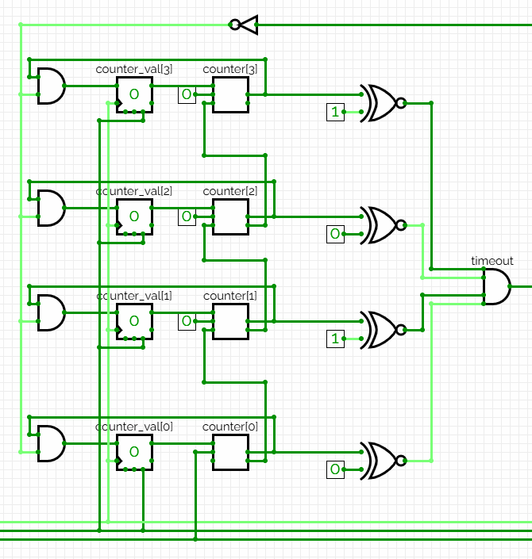
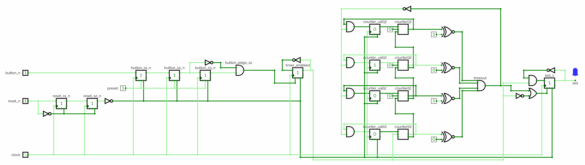

# Appendix A - Timers

## A.1 Timers: a counter with a target
A **timer** answers a different question than the counter from
[L06 A.1](../../L06/appendix/a_counters_and_shift_registers.md#a1-from-registers-to-counters). A
counter answers "what is the current count?"; a timer answers "has a certain amount of time passed?"

It does that with three parts: an internal counter invisible from outside, a target value
`TICK_COUNT` fixed per instance, and a comparison that when true clears the counter and pulses an
output flag `timeout` for one clock cycle.

Because the system clock ticks at a known, fixed frequency, counting ticks is the same as measuring
elapsed time. On the DE0-CV that is 50,000,000 ticks per second:

```text
TICK_COUNT = seconds x 50,000,000 - 1
```

The `- 1` is there because the counter runs `0` through `TICK_COUNT` inclusive, so a full period
is `TICK_COUNT + 1` cycles, not `TICK_COUNT`. [Appendix B](./b_exercises.md) exercise 3 turns on
exactly that, so it is worth reading off this formula rather than the round number beside it:

* `TICK_COUNT = 49,999,999`: timeout once per second.
* `TICK_COUNT = 24,999,999`: twice per second.
* `TICK_COUNT = 4,999,999`: ten times per second.

The rest of this appendix writes the round `50,000,000` and `5,000,000` where the exact cycle
count does not matter: one tick in fifty million is between 0.02 and 0.2 ppm at these values, far
below the board oscillator's own tolerance.

This is the inverse of a blocking `_delay_ms()`. A blocking delay stops the whole program
to wait; a timer runs permanently in parallel with everything else and simply raises a flag, and
nothing in the design is ever blocked waiting for it.

---

## A.2 Building a timer by hand in CircuitVerse
Before writing any VHDL, build a timer as a gate network, exactly as you did for L01-L02's
combinational circuits and L03's flip-flops. A timer is small enough to draw in full, and drawing it
is what makes A.3's VHDL read as a description of something you already understand rather than a new
idiom to memorize.

Build it at a size you can watch: a **4-bit counter** with `TICK_COUNT = 10`, which is `1010`. The
real design counts to 50,000,000; nothing about the structure changes, only the width.

**Start from the counter you already built** in
[L06 A.1](../../L06/appendix/a_counters_and_shift_registers.md#a1-from-registers-to-counters): a
4-bit register `Q0` to `Q3` sharing one clock, an adder and a constant `1` with the sum fed back to
the `D` inputs, and nothing else. If you did not keep it, it is three elements and about five
minutes to redraw. Confirm it still counts and wraps before adding anything, so that when the timer
misbehaves later you know the counter underneath is sound.

Everything here adds **two things on top of that**: a comparison saying "the count has arrived", and
a clear that makes it repeat. That is the entire difference between a counter and a timer.

**Add the comparison.** You want `timeout` high exactly when the four bits spell `1010`, and the
clean way to build "are these two numbers equal?" is one **XNOR gate per bit**. An XNOR outputs `1`
when its inputs are the *same*, which is L01 A.1's XNOR column read as an equality test. Wire four,
each comparing a counter output against the corresponding target bit (`Q3` against `1`, `Q2` against
`0`, `Q1` against `1`, `Q0` against `0`), driving the target side from a CircuitVerse constant rather
than a wire you might later mistake for a signal. Then AND the four outputs together; that single
AND gate is `timeout`:

Writing `⊙` for XNOR, which is the one operator L01 A.2 gave no symbol to:

```math
timeout = (Q3 \odot 1) \cdot (Q2 \odot 0) \cdot (Q1 \odot 1) \cdot (Q0 \odot 0)
```

All four bits must match at once, which is what "the counter has reached `1010`" means. This is a
**general equality comparator**, worth recognizing as its own building block: the same four XNORs
plus an AND compare against any 4-bit value, and only the constants change.

**Add the clear**, so the timer restarts rather than running on: feed `timeout` back to force the
counter to `0000` on the next edge, gating each flip-flop's `D` input so `timeout = 1` overrides the
adder's output. Without it the counter keeps going to `1111` and wraps on its own, so `timeout`
fires every sixteen edges rather than every eleven. Both are periodic; only one has the period you
asked for.

**Then confirm, one clock edge at a time:**
* The counter advances `0000` through `1010`, and `timeout` is low for every count except `1010`.
  Watch the four XNOR outputs as it counts and notice how often three are high at once. Three
  matching bits is not a match; the AND gate is what insists on all four.
* On the edge after `timeout` fires the counter is back at `0000` and `timeout` is low, so it is high
  for exactly one clock cycle, never two.
* The full cycle is therefore eleven edges, counts `0` through `10` inclusive, repeating
  indefinitely. That is A.1's `TICK_COUNT + 1` off-by-one, and this is the easiest place in the
  course to see it, because you can count the edges by eye.



The drawing is cropped to the part this section adds. It labels the counter's bits `counter[3]` down
to `counter[0]` where the text above calls them `Q3` to `Q0`, and the increment feeding them is
drawn as gate-level carry logic rather than the single adder block L06 A.1 used, because that is
what CircuitVerse gives you when you build it a bit at a time. The four XNORs, their constants
`1`, `0`, `1`, `0`, and the AND that combines them are the whole of what is new here.

Two things are worth noticing before the VHDL, because both are what the language buys you:
* **The comparator is hard-wired to one target.** Changing `TICK_COUNT` from `10` to `12` means
  going back into the drawing and flipping two constants. It is a small edit, but it is an edit to
  the *circuit*, and every instance needs its own copy. In A.3 the target becomes a generic.
* **The width is hard-wired too.** Counting to 50,000,000 needs 26 flip-flops and a 26-bit
  comparator, 26 XNORs across 52 inputs: the same circuit, an unreasonable drawing. In A.3 it is the
  same six lines of VHDL either way.

That is the trade this course makes constantly: draw the circuit once, at a size you can see, to
know what the tool is building for you, then let the tool build it at a size you could not have
drawn.

---

## A.3 The `timer` module in VHDL
The same circuit as a reusable module. It is built live during the lecture, and
[exercise 4](./b_exercises.md) asks you to write it yourself afterwards, so it is printed here in
full rather than shipped as a file:

```vhdl
entity timer is
    generic(TICK_COUNT: natural := 50_000_000);
    port(clock, reset_s2_n, enable: in std_logic;
         timeout                  : out std_logic);
end entity;

architecture behaviour of timer is
-- Internal tick counter.
signal counter: natural range 0 to TICK_COUNT;
begin
    process(clock, reset_s2_n) is
    begin
        if (reset_s2_n = '0') then
            timeout <= '0';
            counter <= 0;
        elsif (rising_edge(clock)) then
            timeout <= '0';
            if (enable = '1') then
                if (TICK_COUNT > counter) then
                    counter <= counter + 1;
                else
                    timeout <= '1';
                    counter <= 0;
                end if;
            end if;
        end if;
    end process;
end architecture;
```

* `TICK_COUNT` is a **generic**, not a constant baked into the architecture, so the same entity
  serves any frequency by instantiating it with a different `generic map`. The internal counter's
  range is written in terms of it, so the register is sized to the target rather than to whatever an
  unconstrained `natural` would give, the same point
  [L06 A.1](../../L06/appendix/a_counters_and_shift_registers.md#a1-from-registers-to-counters)
  makes about `natural range 0 to 15`. A generic can size a signal precisely because it is fixed
  before synthesis runs.
* `reset_s2_n` is the already-*synchronized* reset (A.4), never the raw asynchronous `reset_n`. A
  timer never touches a raw asynchronous input directly.
* `enable` **freezes** the timer rather than resetting it. While it is `'0'`, `counter` holds its
  value and `timeout` stays low, and a disabled timer resumes from where it left off rather than
  restarting. L08's `fsm_led` depends on this.
* `timeout` is a single-cycle pulse. The `else` branch that sets it is reached on only one edge: the
  edge at which `counter` is already sitting at `TICK_COUNT` and is cleared back to `0`. On the
  following edge the unconditional `timeout <= '0';` runs with nothing after it to override, so the
  pulse is exactly one cycle wide.

Compare this against A.2's gate network. The logic is the same, and A.2 already named what the
generic buys. One difference it did not: A.2's `timeout` is a combinational decode, high during the
cycle the count reads `1010`, while this one is registered, high one cycle later, during the cycle
`counter` reads `0`. Same period, different phase, and different glitch behaviour, which is the
registered-versus-combinational point
[L08 A.5](../../L08/appendix/a_state_machines.md#a5-mealy-machines-the-one-cycle-difference)
returns to.

---

## A.4 Composing a full timer circuit
A timer alone only pulses `timeout`; something has to react to that pulse, and a button has to
control the timer. Reusing L04's double-flop synchronizer, a complete button-controlled,
timer-driven LED circuit looks like this:



Read that one as a floor plan rather than as wiring. It is a wide circuit, so at page size its
labels are small; what it is for is showing how few pieces there are and roughly where each one
sits. The two closer views below are where the signal names are legible, and between them they
cover everything in it.

Left to right:
* **Synchronization and edge detection.** `button_n` passes through two flip-flops for metastability
  protection, then a third lets the circuit compare "now" against "previous" and detect a falling
  edge, producing a one-cycle `button_edge_s2` pulse:

  

* **The timer** (A.3), enabled or disabled by `timer_enabled`, which is itself toggled by
  `button_edge_s2`.
* **Toggling the LED.** The timer's `timeout` pulse flips the LED's state each time it fires, and
  the LED is forced off whenever the timer is disabled or the circuit is reset:

  

Two patterns matter here, independent of this circuit:
* **Every asynchronous input is synchronized before it touches any other logic**, and every
  enable/toggle signal derived from a button is a synchronous signal from that point on. You reuse
  this unchanged in A.5 and again for L08's state machines.
* **One clock, and everything else is an enable.** `timeout` paces the LED by being a one-cycle
  *enable* on a flip-flop that runs on the system clock, not by being wired into a clock input. It
  is tempting to route a counter or timer output into a clock port to "slow things down"; do not.
  A design with one clock is a design whose timing the tool can analyze, and it is the single most
  common mistake a programmer makes writing a baud generator.

---

## A.5 FPGA implementation: a walking-LED shift register
`walking_led` is the first design that composes three lectures' building blocks into one
hardware-demonstrable circuit: a single lit LED walking along a row, one position per timer tick,
started and stopped with a button. It is built live during the lecture, and
[exercise 6](./b_exercises.md) asks you to write it yourself afterwards, so it is printed here in
full rather than shipped as a file.

It writes almost no new logic, reusing unchanged `reset_sync` and `button_sync`
([L04 A.5](../../L04/appendix/a_metastability_and_synchronization.md#a5-synchronizing-a-reset-signal-assert-async-release-sync)
and [A.6](../../L04/appendix/a_metastability_and_synchronization.md#a6-reusing-the-chain-for-edge-detection---and-incidentally-debouncing))
to synchronize and edge-detect the button, `timer` ([A.3](#a3-the-timer-module-in-vhdl)) to pace the
rate, and the shift register from
[L06 A.2-A.4](../../L06/appendix/a_counters_and_shift_registers.md#a2-shift-registers) for the
walking itself. That is what the last four lectures have been accumulating: a small set of modules
that compose.

You write all three yourself: `reset_sync` and `button_sync` in
[L04 exercises 8 and 9](../../L04/appendix/b_exercises.md), `timer` in
[exercise 4](./b_exercises.md) of this lecture. Copy your own into the exercise directory before
building this. Reusing a module means having one, and this is the first design that asks you for
the ones you already built.

```vhdl
entity walking_led is
    generic(LED_COUNT : natural := 8;
            TICK_COUNT: natural := 25_000_000);
    port(clock, reset_n, button_n: in std_logic;
         led                     : out std_logic_vector(LED_COUNT-1 downto 0));
end entity;

architecture behaviour of walking_led is
signal reset_s2_n, button_edge_s2: std_logic;
signal button_n_v, button_edge_s2_v: std_logic_vector(0 downto 0);
signal shift_enable, shift_tick  : std_logic;
signal shift_reg: std_logic_vector(LED_COUNT-1 downto 0);

begin
    led <= shift_reg;

    button_n_v(0)     <= button_n;
    button_edge_s2 <= button_edge_s2_v(0);

    reset_sync1: entity work.reset_sync
        port map(clock, reset_n, reset_s2_n);

    button_sync1: entity work.button_sync
        generic map(1)
        port map(clock, reset_s2_n, button_n_v, button_edge_s2_v);

    timer1: entity work.timer
        generic map(TICK_COUNT)
        port map(clock, reset_s2_n, shift_enable, shift_tick);

    SHIFT_ENABLE_PROCESS: process(clock, reset_s2_n) is
    begin
        if (reset_s2_n = '0') then
            shift_enable <= '0';
        elsif (rising_edge(clock)) then
            if (button_edge_s2 = '1') then
                shift_enable <= not shift_enable;
            end if;
        end if;
    end process;

    SHIFT_PROCESS: process(clock, reset_s2_n) is
    begin
        if (reset_s2_n = '0') then
            shift_reg <= (0 => '1', others => '0');
        elsif (rising_edge(clock)) then
            if (shift_tick = '1') then
                shift_reg <= shift_reg(LED_COUNT-2 downto 0) & shift_reg(LED_COUNT-1);
            end if;
        end if;
    end process;
end architecture;
```

Design choices worth noting:
* `button_n_v`/`button_edge_s2_v` bridge a width difference only: `walking_led`'s button signals
  are single bits while `button_sync`'s ports are `COUNT`-wide vectors. The two concurrent
  assignments wire the scalar to element `0` and back. They cost no hardware.
* This is a PISO register (L06 A.4) in its simplest form: parallel-loaded exactly once, on reset,
  with a single lit bit at position 0, and from then on only shifting. There is no runtime `load`,
  because this design never loads a new pattern.
* It is a **circular** shift register. The shift is L06 A.2's expression unchanged, so the lit bit
  walks toward the MSB; the only difference from a plain PISO is what feeds bit 0, which is the bit
  falling off the top rather than a `serial_in` from elsewhere. A one-shot "shift a pattern out"
  register becomes an endlessly repeating pattern generator for free, just by recirculating its own
  output.
* `shift_enable` is A.4's toggle flip-flop reused verbatim: the button's synchronized edge pulse
  flips a single bit, and that bit becomes the timer's `enable`.
* `shift_tick` is the timer's `timeout` pulse, reused as the shift register's clock enable rather
  than driving an LED toggle. Same building block, different consumer, and exactly the "one clock,
  everything else is an enable" rule from A.4.
* Both `LED_COUNT` and `TICK_COUNT` are generics, so `generic map(4, 25_000_000)` gives a 4-LED row
  and `generic map(8, 5_000_000)` a faster 100 ms step, without touching the module.

On the board, demonstrated during the lecture, the ports are assigned via the pin planner (see the
Quartus workflow from Lecture 1): `clock` to the 50 MHz oscillator, `reset_n` and `button_n` to two
push buttons, and `led` to a row of onboard LEDs. Press the button once to start the bit walking,
again to freeze it.

You can watch the same behaviour without a board by running the reference testbench, which overrides
both generics so a full lap takes a handful of clock cycles:

```bash
cd lectures/L07/exercises/walking_led
cp ../../../L04/exercises/reset_sync/reset_sync.vhd .   # the three you wrote yourself
cp ../../../L04/exercises/button_sync/button_sync.vhd .
cp ../timer/timer.vhd .
ghdl -a --std=93 reset_sync.vhd button_sync.vhd timer.vhd \
                 walking_led.vhd walking_led_tb.vhd
ghdl -e --std=93 walking_led_tb
ghdl -r --std=93 walking_led_tb --assert-level=error --stop-time=10ms
```

---
