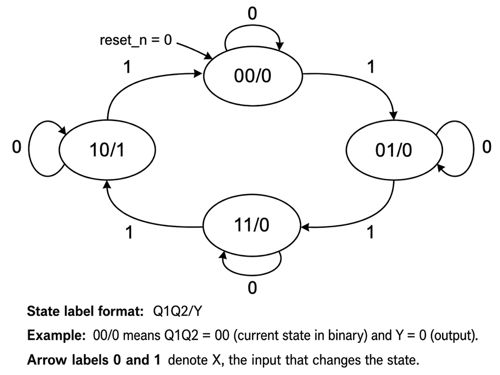
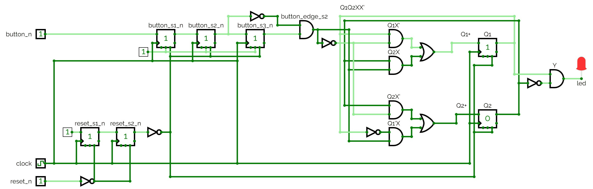

# Appendix A - State Machines

## A.1 What is a finite state machine
A finite state machine (FSM) is a circuit whose behaviour depends not only on its current inputs but
on a finite amount of *history*, summarized in a single value called its **state**. At any moment
the machine is in exactly one state; on each clock edge it may move to a new one, decided by its
current state and inputs; and its output is computed from that state.

None of this is new hardware. An FSM combines two things you already know: a **register** (L03)
holding the current state, one flip-flop per state bit, and **combinational logic** computing the
next state and the output from the current state and the inputs.

What is new is the discipline. Instead of ad hoc logic feeding an ad hoc set of flip-flops, you work
in a fixed order: first draw a **state diagram**, a few named states with labelled transitions
between them, and only once that is right derive the state table, then the next-state logic, then
the gate network or VHDL.

Every synchronous circuit so far is technically a trivial state machine: a counter's state is its
count, a shift register's is its bit pattern. What sets an FSM apart is that the state is not a count
or a shifted pattern but an arbitrary label (`STATE_OFF`, `STATE_BLINK`, ...) whose meaning you
choose and whose next value can depend on the input in any way you like.

Two flavours exist, and the distinction decides what an output may look at:
* **Moore machines**: the output depends *only* on the current state. That is the kind designed by
  hand here.
* **Mealy machines**: the output depends on the current state *and* the current input. A.5 covers
  these briefly, in VHDL only, so you recognize one when you meet it and know the one-cycle
  difference.

---

## A.2 Hand-designing a Moore machine: state diagram, state table, and Karnaugh-derived logic
The same process as every gate network in L01 and L02, applied to a circuit with memory. The worked
example is a small, closed, four-state Moore machine: a circular counter through a Gray-code
sequence, advanced one step per button press.

### Specification
* Four states, each represented by two flip-flops `{Q1, Q2}`:

  | State | `{Q1, Q2}` |
  |---|---|
  | `STATE_0` | `00` |
  | `STATE_1` | `01` |
  | `STATE_2` | `11` |
  | `STATE_3` | `10` |

* A system clock `clock`, and an active-low reset `reset_n` returning the machine to `STATE_0`.
* An active-low push button `button_n`, from which a synchronized, edge-detected pulse `X` is
  derived exactly the way L04's double-flop synchronizer does. `X` is high for exactly one clock
  cycle on a falling edge of `button_n`.
* An output `Y`, connected to an LED, high only in `STATE_3`.
* The machine is **closed**: the state after `STATE_3` is `STATE_0`.
* It is a **Moore** machine: `Y` depends only on `{Q1, Q2}`, never on `X`.

The encoding is a Gray code (`00 -> 01 -> 11 -> 10 -> 00`), where consecutive states differ in
exactly one bit. That is a deliberate choice, not a coincidence:
* With an ordinary binary count (`00 -> 01 -> 10 -> 11`), a transition like `01 -> 10` flips two
  bits at once, and the two flip-flops will not switch at *exactly* the same instant.
* That skew is harmless to the machine itself. Both flip-flops update on the same clock edge, and
  nothing samples the state register in between, so the machine never acts on the intermediate
  value. This is the same argument as L05's critical path: as long as everything settles before the
  next edge, what happens during the settling does not matter.
* What the skew *can* disturb is anything reading the state combinationally. An output decoded
  straight from the state bits, like `Y` below, can glitch briefly while they skew. So can a value
  sampled by a *different* clock domain, which is the case L04 A.3 warned about.
* A Gray code removes both, since only one bit ever changes per transition. That is why it matters
  most on a counter crossing clock domains, and least on a machine whose output is registered.

Encoding is a design decision in general, and this is the one place in the course you make it by
hand. Binary uses the fewest flip-flops; Gray minimizes bits changing per transition; **one-hot**
spends one flip-flop per state so the next-state logic is a single wide OR per state, which is often
fastest on an FPGA where flip-flops are plentiful. Once you write the machine in VHDL as an
enumerated type (A.4), you hand this decision to the synthesis tool, which picks an encoding for you
and re-encodes freely unless you tell it otherwise.

### State diagram



Each state bubble shows the current state and the output as `Q1Q2/Y`, and each arrow is labelled with
the input `X` that triggers it. Each state loops back to itself while `X=0`, and a synchronized
button pulse (`X=1`) advances to the next state, wrapping from `STATE_3` back to `STATE_0`.

### State table
Every combination of the current state and input, giving the next state `{Q1+, Q2+}` and output `Y`:

| Q1 | Q2 | X | Q1+ | Q2+ | Y |
|----|----|---|-----|-----|---|
| 0  | 0  | 0 | 0   | 0   | 0 |
| 0  | 0  | 1 | 0   | 1   | 0 |
| 0  | 1  | 0 | 0   | 1   | 0 |
| 0  | 1  | 1 | 1   | 1   | 0 |
| 1  | 0  | 0 | 1   | 0   | 1 |
| 1  | 0  | 1 | 0   | 0   | 1 |
| 1  | 1  | 0 | 1   | 1   | 0 |
| 1  | 1  | 1 | 1   | 0   | 0 |

### Karnaugh-derived logic
Treating `Q1+` and `Q2+` each as a Boolean function of `{Q1, Q2, X}` and running them through a
Karnaugh map, the same technique as L02:

```text
Q1+ = Q1X' + Q2X
Q2+ = Q2X' + Q1'X
```

Notice the shape of both:
* each is "hold when `X` is `0`, take something from the other bit when `X` is `1`."
* the hold halves, `Q1X'` and `Q2X'`, really are mirror images of each other.
* the advance halves are `Q2X` and `Q1'X`, and that complement on the second one is not a typo: it
  is what makes the sequence a Gray code rather than a plain rotation.

The output `Y` reduces further, straight from the state table, with no dependency on `X` at all,
confirming this is a valid Moore machine:

```text
Y = Q1Q2'
```

### Realizing it as a gate network
`{Q1, Q2}` are each a D flip-flop, exactly like L03's register: `Q1+`/`Q2+` feed the D inputs and
`Q1`/`Q2` are read back from the Q outputs. `Y` is a single two-input AND gate with one input
inverted, reading the current state. That is the entire machine: two flip-flops and a handful of
gates computing `Q1+`, `Q2+` and `Y` from `{Q1, Q2, X}`.

---

## A.3 From gate network to CircuitVerse
Before writing any of this in VHDL, realize it by hand in
[CircuitVerse](https://circuitverse.org/simulator), exactly as every gate network in L01 was:
double-flop synchronize `button_n` and `reset_n`, edge-detect the synchronized button to produce `X`,
wire `Q1+`/`Q2+` into a pair of D flip-flops, and wire `Y` straight into the LED.



Reading it left to right:
* `button_n` passes through three synchronizer flip-flops
  (`button_s1_n`/`button_s2_n`/`button_s3_n`).
* An AND gate derives `button_edge_s2` (this circuit's `X`) from the second and third stages.
* The four vertical rails labelled `Q1Q2XX'` carry the state bits and the edge pulse across to the
  gates on the right, which implement A.2's `Q1+`/`Q2+` equations.
* The two labelled flip-flops store `Q1`/`Q2` and feed the final AND/NOT gates producing `Y`, wired
  to `led`.
* `reset_n` is synchronized by its own pair of flip-flops at bottom left, exactly like every other
  synchronized reset in this course.

Open the live circuit yourself: [fsm_gate_network.cv](./images/fsm_gate_network.cv). Step it by hand,
one button press at a time, and confirm it visits `STATE_0 -> STATE_1 -> STATE_2 -> STATE_3 ->
STATE_0` in order, with the LED lighting only on `STATE_3`.

---

## A.4 The same machine in VHDL
That was the last time in this course you will design a machine by hand. Everything from here
writes it directly in VHDL, which is worth having earned rather than started with: the synthesis
tool does exactly what you just did on paper, and when a state machine misbehaves you will be
debugging the diagram, not the VHDL.

The translation replaces the explicit state table and Karnaugh equations with an **enumerated type**
naming each state, a **case statement** describing each state's transitions, and the synthesis tool
left to work out the flip-flop encoding and gate-level logic.

### The enumerated state type
Suppose a machine with three states controlling an LED: `STATE_OFF`, `STATE_BLINK` (blinking at a
fixed rate) and `STATE_ON`. VHDL declares exactly those three values as a new type:

```vhdl
type state_t is (STATE_OFF, STATE_BLINK, STATE_ON);
signal state: state_t;
...
state <= STATE_ON;
```

### The case-statement pattern
The machine is almost always a synchronous process updating `state` on the rising edge via a `case`,
one branch per state, with an asynchronous reset returning it to a known starting state. Assuming
`to_next_state` and `to_prev_state` are synchronized, edge-detected pulses produced exactly like `X`
in A.2 and A.3:

```vhdl
process(clock, reset_s2_n) is
begin
    if (reset_s2_n = '0') then
        -- On reset, go to STATE_OFF.
        state <= STATE_OFF;
    elsif (rising_edge(clock)) then
        case (state) is
            when STATE_OFF =>
                if (to_next_state = '1') then
                    state <= STATE_BLINK;
                elsif (to_prev_state = '1') then
                    state <= STATE_ON;
                end if;
            -- STATE_BLINK and STATE_ON follow the same shape.
            when others =>
                state <= STATE_OFF;
        end case;
    end if;
end process;
```

`case (state) is ... end case;` must cover every value `state_t` can take, and `when others` keeps
it exhaustive if you add a state later and forget a branch.

What `when others` is *not* is a safety net against a corrupted state register. Once every state
has its own branch, as in `fsm_led.vhd` below - the listing above abbreviates two of them away,
so *its* `when others` is reachable and would wrongly reset the machine from `STATE_BLINK` or
`STATE_ON` - every value of `state_t` is already named above it, so the branch is unreachable in
the source and synthesis
normally optimizes it away rather than building recovery logic. Once Quartus re-encodes the machine,
most bit patterns are illegal, and recovering from one requires Quartus's Safe State Machine setting
rather than anything you can write in VHDL.

### Worked example: `fsm_led`
[`fsm_led/fsm_led.vhd`](../fsm_led/fsm_led.vhd) implements exactly that three-state machine,
extended to two buttons: `button_n(0)` advances, `button_n(1)` goes back, the states are closed in a
loop, and `STATE_BLINK` toggles the LED every 100 ms.

Three subcomponents are reused, all of them modules you wrote yourself:
* `reset_sync`: L04's reset synchronizer, unchanged
  ([L04 exercise 8](../../L04/appendix/b_exercises.md)).
* `button_sync`: L04's button synchronizer, also unchanged, but instantiated with `generic map(2)`
  so it handles both buttons at once, producing a two-bit pulse vector. This is the payoff of the
  generic: the file is identical to the one L04 and L07 instantiate with `1`
  ([L04 exercise 9](../../L04/appendix/b_exercises.md)).
* `timer`: L07's timer, unchanged ([L07 exercise 4](../../L07/appendix/b_exercises.md)). `fsm_led`
  declares its own `TIMER_TICK_COUNT` generic and passes it straight through, defaulting to
  `5_000_000` for 100 ms at `50 MHz`, and only enables the timer while in `STATE_BLINK`.

None of the three is shipped in `fsm_led/`: copy your own in before building the example. By this
point in the course that is four lectures' worth of your own modules composed into one design,
which is the thing worth noticing about it.

Two synchronous processes implement the machine:
* `STATE_PROCESS` is the `case` transition logic above, driven by `to_next_state`/`to_prev_state`,
  derived combinationally from `button_edge_s2`. Each requires the *other* button's pulse to be
  `'0'` in the same cycle, so pressing both close enough together that their pulses land on one clock
  cycle moves the machine nowhere rather than picking a winner arbitrarily. An ambiguous input
  deserves a defined answer, and "do nothing" is the one that cannot surprise you.
* `LED_PROCESS` drives `led_s` purely from the current state: off in `STATE_OFF`, on in `STATE_ON`,
  toggling on every timer timeout in `STATE_BLINK`. Because it never reads `button_n` or
  `button_edge_s2` directly, only `state`, this is a genuine Moore machine: the LED reacts to a
  press only indirectly, through the state it caused.

---

## A.5 Mealy machines: the one-cycle difference
Everything so far has been a **Moore** machine, deliberately: Moore is the safer default and the
form you design by hand. A **Mealy** machine relaxes the rule that defines a Moore machine: the output may depend on the
current state *and* the current input, computed combinationally. It is not stored in a register, and
it changes within the same clock cycle the input does.

### The behaviour: detect two consecutive `1` bits
A serial input `din` carries one bit per clock cycle, and `y` should indicate that the last two bits
were both `1`, with overlapping matches counting, so `111` reports a match twice.

As a Mealy machine this needs only two states, because the output can react to the input *before* it
is reflected in the next state: `STATE_IDLE` (the previous bit was `0`, or this is the first) and
`STATE_ONE` (the previous bit was `1`).

| State | `din` | Next state | `y` |
|---|---|---|---|
| `STATE_IDLE` | 0 | `STATE_IDLE` | 0 |
| `STATE_IDLE` | 1 | `STATE_ONE`  | 0 |
| `STATE_ONE`  | 0 | `STATE_IDLE` | 0 |
| `STATE_ONE`  | 1 | `STATE_ONE`  | **1** |

The state process is A.4's `case` pattern; only the output differs. This is
[`seq_detect_mealy/seq_detect_mealy.vhd`](../seq_detect_mealy/seq_detect_mealy.vhd), and its output
assignment is a single concurrent statement, entirely outside any clocked process:

```vhdl
y <= '1' when (state = STATE_ONE and din = '1') else '0';
```

That is a **conditional signal assignment**, and it is the last piece of VHDL syntax this course
introduces. It is a concurrent statement, so it lives in the architecture body rather than inside a
process, and it describes a multiplexer: pick the first value whose condition holds, otherwise the
value after `else`. It is the same hardware you would get from an `if`/`else` inside a combinational
process, written in one line instead of five, and it is worth having because a one-line output
assignment makes it obvious at a glance what the output depends on.

```vhdl
-- These two describe exactly the same multiplexer.
x <= a when sel = '1' else b;

process(sel, a, b) is
begin
    if (sel = '1') then
        x <= a;
    else
        x <= b;
    end if;
end process;
```

Always give it an `else`. Leave one out and you have described a signal that keeps its old value
when no condition holds, which is a latch, exactly as in A.3 of L05. `fsm_led` uses this form three
times, and exercise 4 asks you to use it.

**That one line is the whole distinction.** It reads `din`, so it is Mealy. Move the same condition
inside the clocked process, or drop `din` from it, and you have a Moore machine instead.

### What it costs, and what it buys
The Moore version of this detector needs a **third** state, `M_TWO`, existing purely to remember for
one cycle that the match happened, so the output has something to read that does not depend on the
input. Feed both machines `1, 1, 0, 1, 1, 1`:

| Cycle | `din` | Mealy state (before) | Mealy `y` | Moore state (before) | Moore `y` |
|---|---|---|---|---|---|
| 1 | 1 | `STATE_IDLE` | 0 | `M_IDLE` | 0 |
| 2 | 1 | `STATE_ONE`  | **1** | `M_ONE`  | 0 |
| 3 | 0 | `STATE_ONE`  | 0 | `M_TWO`  | **1** |
| 4 | 1 | `STATE_IDLE` | 0 | `M_IDLE` | 0 |
| 5 | 1 | `STATE_ONE`  | **1** | `M_ONE`  | 0 |
| 6 | 1 | `STATE_ONE`  | **1** | `M_TWO`  | **1** |

The Moore `y` column is exactly the Mealy `y` column shifted down one row. That is the entire trade:
Mealy reports the match the *same* cycle the second `1` arrives where Moore takes one more, and
Mealy needs 2 states where Moore needs 3.

### Which to reach for
Moore, almost always, and it is what the rest of this course and the follow-on CAN course use:
* its output depends on no primary input, so it cannot follow a noisy one.
* a Mealy output can in principle glitch combinationally if its inputs aren't already clean.
* note that "Moore" on its own does not mean glitch-free. An output decoded combinationally from
  several state bits, like A.2's `Y = Q1Q2'`, can still glitch while those bits skew on a
  transition. What makes an output glitch-free is *registering* it, the way `fsm_led`'s
  `LED_PROCESS` does, and that is what you want on anything driving a wire off the chip. A serial
  `tx` line decoded straight from the state bits will emit spurious edges.
* a machine whose output depends on fewer things is a machine with fewer ways to be wrong.

Reach for Mealy only when you specifically need the lower latency or the smaller state count, and
know that you are trading a synchronous output for a combinational one when you do.

---

## A.6 FPGA demonstration
`fsm_led` synthesizes and runs exactly the way every VHDL design has since L01: create a Quartus
Prime Lite project targeting the DE0-CV's `5CEBA4F23C7N`, add the `.vhd` files for the example and
its subcomponents, compile, assign each port to a physical pin in the Pin Planner, then recompile and
program the board.

For `fsm_led`, assign `clock` to the 50 MHz oscillator pin, `reset_n` and `button_n(1 downto 0)` to
three push buttons, and `led` to an onboard LED. Then confirm that pressing "next" repeatedly cycles
the LED `off -> blinking -> on -> off`, that "previous" runs the other way, and that reset returns it
to off.

`seq_detect_mealy` is deliberately **not** demonstrated on the board. It consumes one bit per clock
cycle, and a switch flipped by hand holds its value for millions of cycles, so the only thing an LED
can show is the degenerate case: `din` held high, `y` high from the second cycle onward. The
one-cycle distinction the whole of A.5 is about happens far too fast to see. Run its testbench
instead, which is the general lesson rather than an exception:

```bash
cd lectures/L08/seq_detect_mealy
cp ../../L04/exercises/reset_sync/reset_sync.vhd .     # the one you wrote in L04
ghdl -a --std=93 reset_sync.vhd seq_detect_mealy.vhd seq_detect_mealy_tb.vhd
ghdl -e --std=93 seq_detect_mealy_tb
ghdl -r --std=93 seq_detect_mealy_tb --assert-level=error --stop-time=10ms
```

Exact pin numbers depend on which DE0-CV buttons and LEDs you choose, assigned the same way as for
every design since L01. Refer to the DE0-CV's own documentation for its physical pinout if you need
to confirm which header pin corresponds to which labelled button, switch or LED.

---
