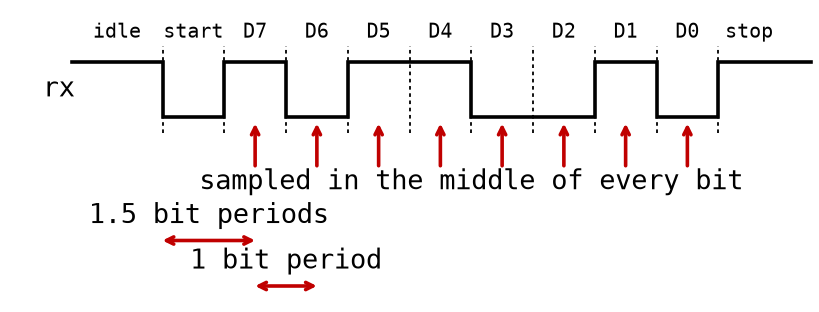

# Appendix B - Exercises

> **How to check your work.** Exercises 1 and 2 are pen-and-paper: they are about getting a state
> machine right *before* it becomes code, and nothing in them needs VHDL, GHDL, or a board.
>
> From exercise 4 on, every exercise that asks you to write a VHDL module ships a self-checking
> testbench under [`exercises/`](../exercises), and nothing else; exercise 3 modifies a module you
> already have and is checked by hand, as it says. Assembling the rest of the directory is part of
> the work: the modules you wrote in earlier lectures (`reset_sync`, `button_sync`, `sync`,
> `timer`) are copied in from wherever you wrote them. Each exercise prints the
> exact commands it needs. Write your
> module in its `exercises/<module>/` directory, using the entity name and the **port order** the
> exercise specifies, then run it with GHDL - see
> [Appendix C](../../L02/appendix/c_testbenches.md) for the three commands.
>
> Exercises 6 and 7 are the course capstones: the two ends of one serial link, a receiver and a
> transmitter. Each composes modules from four different lectures, so each needs more than one
> `ghdl -a` argument, and so do exercises 4 and 5. Where that is the case, the exercise prints the
> command it needs.
>
> No FPGA board is needed for any exercise. The Quartus synthesis and board-programming steps are
> demonstrated during the lecture; your job afterwards is to get the VHDL right, and the testbench
> is how you confirm it.

## State Diagrams and State Tables

**1.** Design a new four-state Moore machine, `{Q1, Q2}`, controlling an LED via a single
synchronized, edge-detected button pulse `X` (produced exactly like `X` in the worked example of
[Appendix A.2](./a_state_machines.md#a2-hand-designing-a-moore-machine-state-diagram-state-table-and-karnaugh-derived-logic)).

It differs from that worked example in two ways:
* The state order is the ordinary binary count `00 -> 01 -> 10 -> 11 -> 00`, **not** the Gray code
  used in A.2.
* The LED (`Y`) lights in **two** states instead of one:
  * Whenever `Q1 = 1` (i.e. in both `10` and `11`).

**a)** Draw the state diagram:
* Four states.
* One transition arrow per state for `X = 1`.
* One self-loop per state for `X = 0`.

**b)** Fill in the full state table (all eight rows of `{Q1, Q2, X}`).

**c)** Derive `Q1+`, `Q2+`, and `Y` via Karnaugh maps, the same way A.2 derives them for the
Gray-code version.

**d)** Realize the gate network by hand:
* Two D flip-flops for `{Q1, Q2}`.
* Gates computing `Q1+`, `Q2+`, and `Y`.
* Build and simulate it in CircuitVerse, double-flop synchronizing and edge-detecting the button
  input exactly as in
  [Appendix A.3](./a_state_machines.md#a3-from-gate-network-to-circuitverse).

**e)** Verify it in CircuitVerse, against your own state table. There is no testbench for this
machine, and there is not meant to be: the state table you derived in **b)** *is* the specification,
and checking a circuit against a specification you worked out yourself is the whole point of the
exercise.

Step the clock by hand and check, in this order:
* **The advance path.** Pulse `X` once per step and walk a full lap, `00 -> 01 -> 10 -> 11 -> 00`.
  Before each edge, read the expected next state off your table. After the edge, read `{Q1, Q2}` off
  the flip-flop outputs. All four transitions must agree.
* **The hold path.** In each of the four states, step the clock with `X = 0` and confirm the machine
  stays put. That is four more checks, and it is the half people skip; a machine that advances
  correctly but does not hold is a machine whose `X'` terms are wrong.
* **The output.** In every state, check `Y` against your table: high in `10` and `11`, low in `00`
  and `01`. Do this as its own pass, not while you are watching the state bits.

Where they disagree tells you which gate to look at. A wrong `Q1+` shows up only on the transitions
where `Q1` was supposed to change. A wrong `Y` shows up with the state sequence still perfectly
correct, which is why it is worth a separate pass.

**Tip:** Since the state order changed from Gray code to binary, expect a transition (`01 -> 10`)
where *two* state bits flip at once. Per A.2 that is harmless to the machine itself, since nothing
samples the state register between edges, and CircuitVerse's ideal simulation will not show you
anything either way. What it does affect is `Y`, which here is decoded combinationally from the
state bits: on real hardware `Y` can glitch briefly while those two bits skew. Notice which
transition it is, and what you would do about it if `Y` were driving something that cared.

---

## Sequence Detection

**2.** Design a **Moore** machine that detects the sequence `1, 0, 1` arriving one bit per clock
cycle on an input `din`, raising its output `y` once the third bit of a match has been seen.
* Non-overlapping is fine here: after a full match, start looking for a fresh `1, 0, 1` from
  scratch, rather than reusing the trailing bits.

**a)** Draw the state diagram:
* One state per amount of the pattern matched so far.
* An arrow out of every state for `din = 0` *and* for `din = 1`; a sequence detector is never idle,
  it is always either advancing or falling back.
* Mark which state drives `y = 1`.

**b)** Fill in the state table, one row per (state, `din`) combination.

**c)** Trace it. Pick a six-bit sequence for `din` containing at least one match, and record, cycle
by cycle:
* The state before the edge.
* The value of `din`.
* The output `y`.

**d)** The trap in this machine is the fall-back arrows, not the forward ones. For each state, say
what happens on the input that does *not* advance the match:
* Which of them return to the start?
* Is there any input that should send you back to a *partially* matched state rather than all the
  way to the beginning? Explain your answer for this pattern.

**Tip:** count your states before you draw them. "Nothing matched yet", "saw `1`", "saw `10`",
"saw `101`" is the natural decomposition, and the last of those is the one that drives `y`.

**Keep your answer.** Exercise 4 below implements this same detector in VHDL, as a Mealy machine -
which, per [Appendix A.5](./a_state_machines.md#a5-mealy-machines-the-one-cycle-difference), needs
one state fewer than what you just drew. Working out which of your states disappears, and why, is
part of that exercise.

---

## Finite State Machines in VHDL

**3.** Extend `fsm_led` with a fourth state, `STATE_FAST_BLINK`, blinking at 20 ms instead of
`STATE_BLINK`'s 100 ms. Follow the worked example in
[Appendix A.4](./a_state_machines.md#a4-the-same-machine-in-vhdl).

Work on a **copy** of the module, not on `lectures/L08/fsm_led/fsm_led.vhd` itself. Copy the whole
directory somewhere of your own first, along with the three modules of your own that it
instantiates:

```bash
cp -r lectures/L08/fsm_led /tmp/fsm_led_fast
cp lectures/L04/exercises/reset_sync/reset_sync.vhd /tmp/fsm_led_fast     # the three you wrote
cp lectures/L04/exercises/button_sync/button_sync.vhd /tmp/fsm_led_fast   # yourself
cp lectures/L07/exercises/timer/timer.vhd /tmp/fsm_led_fast
cd /tmp/fsm_led_fast
```

There is no testbench to run here, but the four-state machine should still analyze, and that is
worth doing after every edit: it catches a missing `case` branch, or a `state_t` value you added in
one process and not the other.

```bash
ghdl -a --std=93 reset_sync.vhd button_sync.vhd timer.vhd fsm_led.vhd
```

The reason is worth knowing, because it is a real hazard and not busywork. `fsm_led` ships a
reference testbench, `fsm_led_tb.vhd`, and exercise 5 asks you to run it. That testbench asserts
the **three**-state cycle: it presses the button once from `STATE_BLINK` and checks that the LED
goes solid, because in the machine as written the next state is `STATE_ON`. In your four-state
version that press lands in `STATE_FAST_BLINK`, the LED is still blinking, and the assertion
fails. Nothing about the failure tells you which of the two exercises it belongs to. Keep the
reference machine intact and that question never comes up.

There is no testbench for the four-state machine. Check it the way A.2 had you check a state
diagram: predict the sequence of states for a run of button presses, then read your `case`
branches back and confirm they agree.

You'll need to:
* Add the new value to `state_t`.
* Add a branch to each `case` statement, in both `STATE_PROCESS` and `LED_PROCESS`.
* Handle the two blink rates, by either:
  * Adding a second timer instance, or
  * Making the existing timer's tick count switch based on the current state.

---

**4.** Implement the `1, 0, 1` detector from exercise 2 in VHDL, in a new directory
`seq_detect_101_mealy` - this time as a **Mealy** machine.

Start from your Moore state diagram and convert it:
* Your final "saw `101`" state exists only to hold the output high for one cycle.
* A Mealy machine doesn't need it: the output condition can read `din` directly in the state that
  has already matched `1, 0`.
* Drop that state, and move its output into the condition on `y`.

Then follow the `type state_t is (...)` / `case` pattern from
[Appendix A.4](./a_state_machines.md#a4-the-same-machine-in-vhdl) and
[Appendix A.5](./a_state_machines.md#a5-mealy-machines-the-one-cycle-difference):
* Reuse `reset_sync` for `reset_n`, exactly as
  [`seq_detect_mealy.vhd`](../seq_detect_mealy/seq_detect_mealy.vhd) does. There is no button in
  this design, so `button_sync` is simply not instantiated.
* Make sure the output assignment for `y` is a single concurrent statement, outside any clocked
  process, depending on both `state` and `din`, not just `state`.
  * Otherwise you've quietly built a Moore machine instead, and its output will arrive one cycle
    late - which is exactly what the testbench checks.


**Self-check:** name your entity `seq_detect_101_mealy`, with ports `clock`, `reset_n`, `din` (in)
and `y` (out), declared in that order to match `seq_detect_mealy`. A testbench is in
[`exercises/seq_detect_101_mealy/`](../exercises/seq_detect_101_mealy); it checks a non-overlapping
"101" detector. Your module instantiates `reset_sync`, which is not shipped there because you wrote
it in [L04 exercise 8](../../L04/appendix/b_exercises.md): copy your own in. This is the first
exercise that needs more than one file on the `ghdl -a` line, with the subcomponent first so GHDL
sees it before the module that instantiates it:

```bash
cd lectures/L08/exercises/seq_detect_101_mealy
cp ../../../L04/exercises/reset_sync/reset_sync.vhd .     # the one you wrote in L04
ghdl -a --std=93 reset_sync.vhd seq_detect_101_mealy.vhd seq_detect_101_mealy_tb.vhd
ghdl -e --std=93 seq_detect_101_mealy_tb
ghdl -r --std=93 seq_detect_101_mealy_tb --assert-level=error --stop-time=10ms
```

---

## Reading the Worked Machine

**5.** `fsm_led` is demonstrated on the DE0-CV during the lecture (see
[Appendix A.6](./a_state_machines.md#a6-fpga-demonstration)). This exercise checks that you
can account for what you saw, and it ships a reference testbench you can run yourself. It reuses
your two L04 synchronizers and your L07 `timer`, none of which it ships, so copy them in first:

```bash
cd lectures/L08/fsm_led
cp ../../L04/exercises/reset_sync/reset_sync.vhd .     # the three you wrote yourself
cp ../../L04/exercises/button_sync/button_sync.vhd .
cp ../../L07/exercises/timer/timer.vhd .
ghdl -a --std=93 reset_sync.vhd button_sync.vhd timer.vhd \
                 fsm_led.vhd fsm_led_tb.vhd
ghdl -e --std=93 fsm_led_tb
ghdl -r --std=93 fsm_led_tb --assert-level=error --stop-time=10ms
```

**a)** Work out the blink rate from the source, not from the demonstration:
* `fsm_led` instantiates `timer` with `TIMER_TICK_COUNT` defaulting to `5_000_000`, on a `50 MHz`
  clock.
* How long is one timeout period?
* `STATE_BLINK` toggles the LED on each timeout. What is the resulting **blink** frequency, and
  why is it half what you might first write down?

**b)** The testbench overrides `TIMER_TICK_COUNT` with a much smaller value than the default:
* Find that override in [`fsm_led_tb.vhd`](../fsm_led/fsm_led_tb.vhd).
* Explain why a testbench cannot reasonably use the real value, and roughly how long a simulation
  of one real blink period would have to run.

**c)** Account for the state machine's behaviour:
* All three states are reachable in both directions. Trace the presses of `button_n(0)` and
  `button_n(1)` that visit every state and return to `STATE_OFF`.
* Press both buttons on the same clock cycle. What does `fsm_led` do, and which two lines of the
  architecture decide that?
* `timer_enable` is driven from `state`, so the timer only runs in `STATE_BLINK`. Note that the
  `timer` **pauses** rather than clears when disabled (L07 A.3). What does that mean for the
  moment you re-enter `STATE_BLINK` after leaving it, and would holding `timer_enable` high
  permanently be better or worse?

---

## Capstone: A Serial Receiver
**6.** This is the first half of the course capstone, and it composes four lectures into one
design. Exercise 7 builds the other end of the same serial link, so do not stop here. Nothing in
it is a new idea; all of it is wiring together modules you already have, around a state machine
you design yourself:
* [L04](../../L04/README.md)'s `reset_sync`, synchronizing the reset.
* [L05](../../L05/README.md)'s `sync`, synchronizing the `rx` line, which arrives from somebody
  else's crystal and is asynchronous in exactly the sense L04 means.
* [L07](../../L07/README.md)'s `timer`, generating the oversample tick.
* This lecture's state machine, framing the whole thing, and doing its own shifting and bit
  counting. You built that as a module in [L06](../../L06/README.md); here it is four lines inside
  the machine that already has the counters it needs, which is the more usual way a receiver is
  written.

Write an entity named `uart_rx8`: a receiver for one byte of asynchronous serial data, in the
format a UART sends.

### The line format
The `rx` line carries frames, and between frames it sits idle:
* **Idle**: the line is held high.
* **Start bit**: the line goes low for exactly one bit period. This is what marks the beginning of
  a frame; there is no separate clock line, which is what "asynchronous serial" means.
* **Eight data bits**, most significant first, one bit period each.
* **Stop bit**: the line returns high for one bit period.



The frame above carries `10110010`, which is the first byte the testbench sends. The arrows are the
only eight moments the receiver actually looks at the line: one and a half bit periods after the
falling edge, then once per bit period after that.

The receiver has to recover the bit timing from the falling edge of the start bit alone. That is
the entire problem this exercise solves, and it is why the timer is here.

**One deliberate deviation from real UART:** a real UART sends its data bits **least** significant
first, as [L06 A.3](../../L06/appendix/a_counters_and_shift_registers.md#a3-serial-inparallel-out-sipo)
notes. This exercise sends them most significant first:
* the framing and the timing, which are what these two exercises are actually about, are identical
  either way.
* it is the direction L06 A.3's SIPO idiom shifts, so the receiver's shift is one line, and the
  transmitter in exercise 7 is its mirror.
* the provided testbenches transmit and expect MSB-first to match, so the pair is self-consistent.
* to speak to a real UART you would flip the shift direction to L06 A.2's mirror-image form and
  change nothing else. The follow-on UART course does exactly that. Worth knowing before you wire
  this to a PC's serial port and wonder why every byte arrives bit-reversed.

### Oversampling: sixteen ticks per bit
The receiver has to find the middle of a bit whose start it can only infer. The technique is
**oversampling**: run the `timer` at **sixteen times** the baud rate, so there are sixteen ticks
per bit period, and count them.

* The falling edge of the start bit resets the tick count to `0`. The timer runs continuously,
  before, during and after a frame; it is the *count* that is reset, never the timer.
* **Tick 8** is half a bit later, the middle of the start bit. Check the line is *still low* there.
  If it has gone high, that was a glitch and not a start bit, and the receiver returns to idle.
  That re-check is what stops noise on an idle line from being read as data.
* From there, every **sixteenth** tick is the middle of the next bit: sample the line and shift it
  in. Eight of those are the data bits, and the ninth is the stop bit.

Sampling mid-bit rather than at the edges is what gives the receiver its timing margin. The
transmitter's clock is a different physical crystal from yours, so the two drift apart over a
frame; a receiver that sampled near the boundaries would read the wrong bit as soon as they did.
Sixteen ticks is the conventional choice and the one the follow-on UART course uses, where the same
tick also drives the transmitter.

### The `uart_rx8` entity

| Generic | Type | Default | Description |
|---|---|---|---|
| `OVERSAMPLE_TICK_COUNT` | `natural` | `325` | The `timer` tick count for **one sixteenth** of a bit period. 9600 baud at `50 MHz`; part **b)** asks you to derive it. |

| Port | Direction | Type | Description |
|---|---|---|---|
| `clock` | in | `std_logic` | System clock. |
| `reset_n` | in | `std_logic` | Asynchronous, active-low; goes through `reset_sync`, as always. |
| `rx` | in | `std_logic` | The serial line, straight off a pin and therefore **asynchronous**. Synchronize it to `rx_s2` before anything else reads it. |
| `data_out` | out | `std_logic_vector(7 downto 0)` | The received byte, valid in the cycle `byte_valid` is high. |
| `byte_valid` | out | `std_logic` | A one-cycle pulse: a complete, well-framed byte is on `data_out`. |
| `frame_err` | out | `std_logic` | A one-cycle pulse: the stop bit was not high, so the frame is broken and no byte is handed over. |

### What to build: the receiver
**a)** Design the state machine **on paper first**, exactly as A.2 had you do. Four states:
  * `STATE_IDLE`, waiting for the line to go low.
  * `STATE_START`, checking at tick 8 that the line is still low.
  * `STATE_DATA`, sampling one bit every sixteen ticks, eight times.
  * `STATE_STOP`, sampling the stop bit sixteen ticks after the last data bit and deciding
    between `byte_valid` and `frame_err`.

Draw it before writing any VHDL, and on the diagram:
* Give every state its **self-loop**: the arrow for "the tick I am waiting for has not arrived
  yet, stay put". That is the arrow that goes missing, and a state without it falls through to
  wherever the `else` happens to point.
* Write beside each state **how many ticks it waits for**, so the tick accounting is on the paper
  rather than in your head.
* Mark where `ticks` is **cleared**. The timer itself never stops, so those clears are the only
  places the receiver decides what "the start of a bit" means.
* Label the arrow out of `STATE_IDLE` with an **edge**, not a level: `rx_s2` low *and* high on
  the previous tick. That needs one bit of history, so note where you are going to keep it.

**b)** Work out the timing before you implement it:
* The DE0-CV clock is `50 MHz` and 9600 baud means 9600 bits per second. How many clock cycles is
  one bit period? How many is a sixteenth of one?
* `timer` pulses every `TICK_COUNT + 1` clock cycles (L07 A.1). What `OVERSAMPLE_TICK_COUNT`
  does that give you? The exact answer is not a whole number, so there are two candidates either
  side of it: work out the error each one leaves, and say which the default above is and why.
* That error is a fraction of a percent, and it accumulates across a frame. Ten bit periods after
  the start edge, how far has your sample point drifted from the middle of the stop bit, measured
  in oversample ticks? How many ticks of margin did it have to begin with?
* Now the reason the answer is comfortable: you resynchronize on every start bit. What would have
  to be true of the frame length for that to stop being enough?

**c)** Implement `uart_rx8`. It instantiates three modules and does the rest itself:
* `reset_sync` for the reset. Everything else in the design takes its `reset_s2_n`.
* **`sync`**, the module you wrote in [L05 exercise 4](../../L05/appendix/b_exercises.md), on the
  `rx` pin, giving the `rx_s2` the state machine reads. Instantiate it at `SIZE = 1` and
  `PRESET = '1'`: an idle line is high, and a synchronizer coming out of reset reading `'0'` would
  look to this machine like a start bit. `rx` arrives from a pin driven by a transmitter with its
  own crystal, so it is asynchronous in exactly the sense L04 means, and every rule from that
  lecture applies unchanged. Note it takes a one-element `std_logic_vector` either side, so you
  declare a pair of those and pull `rx_s2` out of the output.
* `timer`, with `OVERSAMPLE_TICK_COUNT` passed straight through, `enable` tied to `'1'`, and its
  `timeout` as your only sense of elapsed time. Call it `baud_tick`. The timer free-runs: it is
  never stopped, never cleared, and no state ever touches it. What the machine re-phases instead
  is its own `ticks` counter.
* No shift register module. The machine already needs a bit counter, so it shifts the line
  straight into a `frame` signal itself, one line of VHDL per bit sampled.

**The state machine, state by state.** Two counters: `ticks` counting `0` to `15` within one bit,
and `bit_count` counting the eight data bits. Everything below happens **only when
`baud_tick = '1'`**; on every other clock edge the machine sits still. Since the timer free-runs,
a tick is always on its way, in every state including idle.

| State | Waits for | Then | To |
|---|---|---|---|
| `STATE_IDLE` | falling edge on `rx_s2` | clear `ticks` | `STATE_START` |
| `STATE_START` | `ticks` = 8 | `rx_s2` still low? clear `ticks` | `STATE_DATA` |
| | | `rx_s2` high? it was a glitch | `STATE_IDLE` |
| `STATE_DATA` | `ticks` = 15 | shift `rx_s2` into `frame`, clear `ticks` | `STATE_DATA` until 8 bits, then `STATE_STOP` |
| `STATE_STOP` | `ticks` = 15 | `rx_s2` high? `data_out <= frame`, pulse `byte_valid` | `STATE_IDLE` |
| | | `rx_s2` low? pulse `frame_err`, drop the byte | `STATE_IDLE` |

There is no "done" state. The stop-bit sample is where the frame is judged, so that is where the
byte is handed over, and the machine goes straight back to idle.

**Why idle waits for an edge rather than a level.** Keep one tick of history for `rx_s2`, and
leave idle only on the transition from high to low. Testing the level instead, "if `rx_s2` is low,
start a
frame", looks equivalent and passes everything except the one case that matters.

Consider a **break**: the line held low far longer than a frame, which is what a transmitter losing
power looks like. A level test re-arms the instant the previous frame's stop bit is judged, so the
receiver spends the break marching through back-to-back all-zero frames. Each ends on a low stop
bit and is correctly rejected, and that part is fine. The problem is the frame in flight when the
break *ends*: its stop bit is sampled after the line has returned high, so it is a perfectly
well-formed frame as far as the receiver can tell, and a byte made of nothing is handed over as
real data. The edge test does not re-arm during the break at all, because after the first falling
edge there is not another one until the line has recovered.

That is the whole difference, it costs one flip-flop, and it is why a receiver that "works" on
clean data can still hand you garbage the first time a cable is unplugged.

**The shift.** Eight data bits arrive most significant first, so the SIPO idiom from
[L06 A.3](../../L06/appendix/a_counters_and_shift_registers.md#a3-serial-inparallel-out-sipo) does
it with no index arithmetic at all:

```vhdl
frame <= frame(6 downto 0) & rx_s2;
```

`bit_count` then only counts *how many* bits have arrived, never *where* they go. Storing with
`frame(bit_count) <= rx_s2` instead puts the first-arriving bit in bit 0, which reverses the byte:
that is the least-significant-first order a real UART uses, and the follow-on course does exactly
that on purpose. Here the line is MSB first, so the shift is the one that matches.

Four things that decide whether this works:

* **Everything is gated on `baud_tick`.** A state that acts on a plain clock edge runs sixteen
  times per tick and roughly five thousand times per bit.
* **Every state needs its "not yet" path.** If the tick you are waiting for has not arrived, or the
  count has not reached its target, the machine must **stay where it is**. Sending it anywhere else
  in the `else` is the single most common way this design fails, and it fails completely rather
  than subtly: the machine ends up ping-ponging between two states and never reaches the third.
* **Watch the off-by-one on the counter.** With `ticks` starting at `0` and incrementing on each
  tick, the *n*th tick is `ticks = n - 1` at the moment you test it. Whether you compare before or
  after incrementing decides which tick you actually sample on, and being one or two ticks late is
  survivable while being eight is not.
* **The timer free-runs, so your phase comes from `ticks`, never from the timer.** The start edge
  arrives whenever the transmitter sends it, which is somewhere inside a tick period the receiver
  did not choose, so the first tick after that edge can be anywhere from a full tick to almost no
  time later. Clearing `ticks` on the way out of idle is what re-phases sampling onto the start
  bit. That leftover fraction of one tick is the price of never stopping the timer, and it is
  cheap: one sixteenth of a bit, against the half-bit of margin part **b)** asks you to work out.

**d)** Run the testbench. It needs four design files, subcomponents first, and none of the three
subcomponents is shipped in the exercise directory: all three are modules you wrote, `reset_sync`
in L04, `sync` in L05 and `timer` in L07.

```bash
cd lectures/L08/exercises/uart_rx8
cp ../../../L04/exercises/reset_sync/reset_sync.vhd .     # the three you wrote yourself
cp ../../../L05/exercises/sync/sync.vhd .
cp ../../../L07/exercises/timer/timer.vhd .
ghdl -a --std=93 sync.vhd reset_sync.vhd timer.vhd uart_rx8.vhd uart_rx8_tb.vhd
ghdl -e --std=93 uart_rx8_tb
ghdl -r --std=93 uart_rx8_tb --assert-level=error --stop-time=10ms
```

It acts as the transmitter, and checks:
* two clean frames, arriving as the right bytes, with no `frame_err`.
* an idle line, before, between and after them, producing nothing.
* a frame whose stop bit is **low**: `frame_err` must pulse and no byte may be handed over.
* the line held low far longer than a frame, which is a **break**: every frame the receiver thinks
  it sees there ends in a low stop bit, so none of them is a byte.
* a frame in which each data bit carries its value only in the **middle** of the bit period and the
  opposite level either side. A receiver sampling near tick 8 reads it perfectly; one sampling near
  a boundary reads the neighbouring bit.
* that `byte_valid` and `frame_err` are each never high for two cycles in a row.

**Tip:** build it in stages and run the testbench after each, rather than writing all four states
and debugging them at once:
* First get the machine to leave idle on a start bit and reach `STATE_DATA`. If it never gets
  there, the "not yet" path is what to look at.
* Then sample one data bit and check it is the right one before worrying about the other seven.
* Then the stop bit and the two strobes.

**e)** Now break it deliberately, and think about what the result does and doesn't prove:
* Remove the stop-bit state, handing the byte over as soon as the eighth data bit is in.
* Predict what should go wrong, then run it. Two checks catch this, and it is worth knowing which
  fires first: the frame with a low stop bit no longer raises `frame_err`, and it hands over a byte
  that should have been dropped.
* Now the other half of the lesson. Passing is the weaker signal, so find a break the testbench
  does **not** catch. Here is one: **delete the mid-start-bit re-check**, so `STATE_START` moves to
  `STATE_DATA` at tick 8 without confirming the line is still low. The testbench never puts a
  glitch on an idle line, so nothing notices, and on real hardware a single noise spike starts a
  phantom frame. Read `uart_rx8_tb.vhd` and say what you would add to catch it.
* Here is a second: **sample at tick 3 instead of tick 8.** Work out why the testbench still passes,
  and what you have given away. The answer is in part **b)**'s margin calculation.
* And a third, which is the most important of the three: **delete the `rx` synchronizer** and read
  the pin directly. Every check still passes, and it always will, no matter what is added to the
  testbench. Say why, in terms of what a simulator models and what it does not, then reread
  [L04 A.4](../../L04/appendix/a_metastability_and_synchronization.md#a4-timing-intuition-why-almost-certainly-is-good-enough).
  This is the one class of bug in the course that testing cannot reach, which is exactly why L04
  gives you a rule to follow rather than a symptom to look for.
* In a few sentences: what does "passes its testbench" actually promise, and what does it not?


**Self-check:** name your entity `uart_rx8`, with generic `OVERSAMPLE_TICK_COUNT` (`natural`),
inputs `clock`, `reset_n`, `rx`, and outputs `data_out` (`std_logic_vector(7 downto 0)`),
`byte_valid` and `frame_err`, declared in that order. Its testbench is in
[`exercises/uart_rx8/`](../exercises/uart_rx8), and nothing else is: **copy in your own
`reset_sync`, `sync` and `timer`**, as part **d)** shows. A project directory holds everything it
builds from, and assembling it is part of the exercise. L07's `walking_led` is put together the
same way.

---

**7.** The other half of the link: write `uart_tx8`, a transmitter that sends one byte in the same
format exercise 6 receives.

A transmitter is the easier of the two, and the reason is worth understanding before you start:
* The receiver had to *recover* the bit timing from a start edge it didn't control, which is why it
  sampled mid-bit and why its timer ran at a sixteenth of a bit period.
* The transmitter **defines** the timing. Nothing has to be recovered, so the timer runs at a full
  bit period and the machine simply holds each bit on the line for one timeout.

It sends most significant bit first, matching exercise 6's receiver rather than a real UART, for
the reason given there.

### The `uart_tx8` entity

| Generic | Type | Default | Description |
|---|---|---|---|
| `BIT_TICK_COUNT` | `natural` | `5207` | The `timer` tick count for one **whole** bit period, 9600 baud at `50 MHz`. Sixteen of exercise 6's oversample ticks, to within the rounding part **b)** asks you to work out, so a `uart_tx8` and a `uart_rx8` built with the matching defaults speak at the same rate. |

| Port | Direction | Type | Description |
|---|---|---|---|
| `clock` | in | `std_logic` | System clock. |
| `reset_n` | in | `std_logic` | Asynchronous, active-low; through `reset_sync`, as always. |
| `data_in` | in | `std_logic_vector(7 downto 0)` | The byte to send. |
| `send` | in | `std_logic` | A request to transmit `data_in`. Ignored while the transmitter is busy. |
| `tx` | out | `std_logic` | The serial line. **Idles high**, including during reset. |
| `busy` | out | `std_logic` | High from the moment a frame starts until the stop bit is over. |

### What to build: the transmitter
**a)** Draw the state machine first. Four states is the natural decomposition: idle, start bit,
data bits, stop bit, and each one holds the line at a defined level for one bit period:
* Mark what drives `tx` in each state. Notice that `tx` never depends on `send` or any other
  primary input: it is the state, plus the shift register's current output. That makes this a Moore
  machine, like everything else in this course.
* Mark where `busy` comes from. It is one comparison against the state.
* Decide where the byte is captured. It has to be latched when the frame starts, not read
  continuously from `data_in`: the producer is free to change `data_in` the moment `busy` goes
  high, and a real one will.

**b)** Shift the byte out most significant bit first, in the machine itself, the mirror of what the
receiver does:
* Latch `data_in` into a `frame` signal when the frame starts.
* Drive `tx` from the top bit of `frame` while in the data state.
* Shift `frame` up one place per bit period, and count the eight bits out.

You wrote this as a module in [L06 exercise 7b](../../L06/appendix/b_exercises.md), and `piso8` is
worth rereading for the idiom. Instantiating it here would work, but the machine already owns the
bit counter that a PISO register needs, so the shift is one line inside the state it belongs to.
That is how both halves of this link are built, and how the follow-on UART course builds them
too.

**c)** Implement it, instantiating `reset_sync` for the reset and `timer` with `BIT_TICK_COUNT`
passed straight through.

Here the timer's `enable` **is** driven by the state, high only while a frame is in flight, and
that is the one place this design deliberately differs from exercise 6. The receiver had to leave
its timer free-running because it does not control when a frame starts: it can only re-phase its
own tick count once the start edge has already arrived. The transmitter has the opposite problem.
It *decides* when the frame starts, so it can start the timer at that moment and get a first bit
period exactly as long as every other one. Free-run it here instead and the start bit is short by
however much of a tick period happened to be left when `send` arrived, which is a defect in the
one thing a transmitter is responsible for.

Two requirements the testbench is strict about:
* **`send` is ignored while busy.** Reloading mid-frame would restart the byte and corrupt what is
  already on the wire. A request that arrives during a frame is dropped, not queued.
* **`busy` stays high through the whole stop bit**, not just the data bits. The frame is not over
  until the line has been held high for that last bit period.

**d)** Run the testbench. It acts as the receiver: it waits for your start bit, samples the middle
of each bit period, and checks the framing, the byte, the `busy` handshake, and that a `send`
injected two bit periods into a frame is ignored.

```bash
cd lectures/L08/exercises/uart_tx8
cp ../../../L04/exercises/reset_sync/reset_sync.vhd .     # the two you wrote yourself
cp ../../../L07/exercises/timer/timer.vhd .
ghdl -a --std=93 reset_sync.vhd timer.vhd uart_tx8.vhd uart_tx8_tb.vhd
ghdl -e --std=93 uart_tx8_tb
ghdl -r --std=93 uart_tx8_tb --assert-level=error --stop-time=10ms
```

**e)** Answer, in prose:
* A transmitter that skips the stop bit entirely still leaves the line high afterwards, because
  idle and stop are the same level. What actually goes wrong, and when does it first show up?
  * The testbench catches this one. Which of its checks does it, and why could no amount of
    watching `tx` alone have caught it?
* Your receiver in exercise 6 samples in the middle of each bit; your transmitter changes the line
  at the edges. If both ran off crystals differing by 1%, roughly how many bits into a frame would
  the receiver's sampling point drift into the wrong bit? What does that tell you about why serial
  formats have a start bit per byte, rather than one at the beginning of a long message?


**Self-check:** name your entity `uart_tx8`, with generic `BIT_TICK_COUNT` (`natural`), inputs
`clock`, `reset_n`, `data_in` (`std_logic_vector(7 downto 0)`), `send`, and outputs `tx`, `busy`,
declared in that order. Its testbench is in [`exercises/uart_tx8/`](../exercises/uart_tx8), and
nothing else is:
copy in your own `reset_sync` and `timer`, as part **d)** shows.

---
